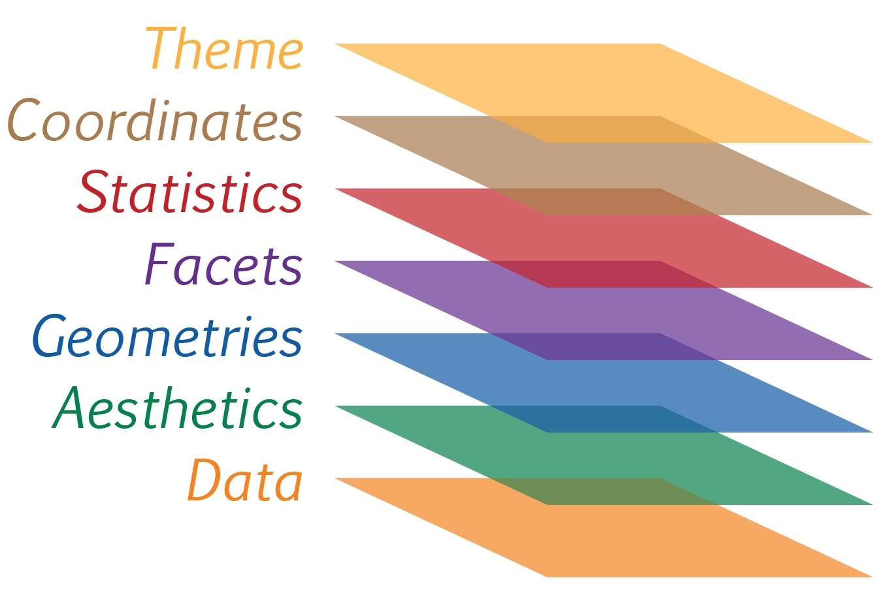
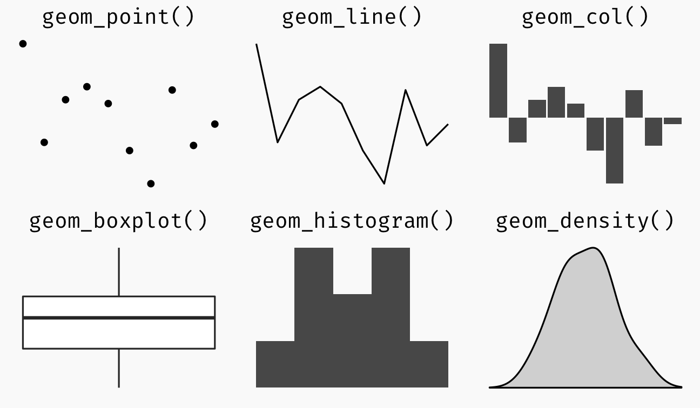

## 1. Learning Outcome

In this chapter, you will explore the fundamental concepts of ggplot2 and understand the key components used to build statistical graphs. You will also gain hands-on experience applying these elements to create visualisations using the layered grammar of graphics.

By the end of the chapter, you should be able to use the core features of ggplot2 to design clear and effective statistical plots.

## 2. Getting started

::: {.panel-tabset}
### Installing and loading libraries

The code chunk below uses `p_load()` of `pacman` package to check if tidyverse packages are installed in the computer. If they are, then they will be launched into R.

```{r}
pacman::p_load(tidyverse,
               patchwork)
```

### Importing Data

The code chunk below imports `exam_data.csv` into R environment by using `read_csv()` function of `readr` package.

`readr` is one of the tidyverse package.

```{r}
exam_data <- read_csv("Hands-on Exercises/Hands-on W1/Exam_data.csv")
```

### Understanding the Data

```{r}
summary(exam_data)
```

Year end examination grades of a cohort of primary 3 students from a local school.

There are a total of seven attributes. Four of them are categorical data type and the other three are in continuous data type.

Categorical attributes are ID, CLASS, GENDER and RACE.

Continuous attributes are MATHS, ENGLISH and SCIENCE.
:::

## 3. Introducing ggplot

### R Graphics VS ggplot
::: {.panel-tabset}
#### R Graphics

```{r}
hist(exam_data$MATHS,
     main = "Distribution of Maths scores",
     xlab = "Score",
     ylab = "Number of Students",
     col = "#7F948F",
     border = "black")
```

#### ggplot2
```{r}
ggplot(data = exam_data, aes(x = MATHS)) +
  geom_histogram(bins = 10,
                 boundary = 100,
                 color = "black",
                 fill = "#7F948F") +
  labs(x = "Score",
       y = "Number of Students",
       title = "Distribution of Maths scores") +
  theme(plot.background = element_rect(fill = "#f5f5f5",
                                       colour = "#f5f5f5"))
```

:::
As you can see that the code chunk is relatively simple if R Graphics is used. Then, the question is why ggplot2 is recommended?

As pointed out by Hadley Wickham, ggplot2 is based on the layered grammar of graphics, which provides a systematic and consistent way to describe statistical graphics. It allows users to build plots layer by layer by mapping data to aesthetic attributes and adding geometric objects, scales, and themes.

This approach makes ggplot2 more flexible, powerful, and easier to extend compared to base R graphics. It also improves readability and reproducibility of code, especially when creating complex visualisations.

## 4. Grammar of Graphics

Before we getting started using `ggplot2`, it is important for us to understand the principles of Grammar of Graphics.

Grammar of Graphics is a general scheme for data visualization which breaks up graphs into semantic components such as scales and layers. It was introduced by Leland Wilkinson (1999) **Grammar of Graphics**, Springer. The grammar of graphics is an answer to a question:

<div style="text-align: center; font-size: 2rem; margin: 1.5rem 0;">
What is a statistical graphic?
</div>

In the nutshell, Grammar of Graphics defines the rules of structuring mathematical and aesthetic elements into a meaningful graph.

There are two principles in Grammar of Graphics, they are:

- Graphics = distinct layers of grammatical elements
- Meaningful plots through aesthetic mapping

A good grammar of graphics will allow us to gain insight into the composition of complicated graphics, and reveal unexpected connections between seemingly different graphics (Cox 1978). It also provides a strong foundation for understanding a diverse range of graphics. Furthermore, it may also help guide us on what a well-formed or correct graphic looks like, but there will still be many grammatically correct but nonsensical graphics.

### A Layered Grammar of Graphics

`ggplot2` is an implementation of Leland Wilkinson’s Grammar of Graphics. Figure below shows the seven grammars of `ggplot2`.



Reference: Hadley Wickham (2010) [“A layered grammar of graphics.”](https://doi.org/10.1198/jcgs.2009.07098) *Journal of Computational and Graphical Statistics*, vol. 19, no. 1, pp. 3–28.

A short description of each building block are as follows:

- **Data**: The dataset being plotted.
- **Aesthetics** take attributes of the data and use them to influence visual characteristics, such as position, colours, size, shape, or transparency.
- **Geometrics**: The visual elements used for our data, such as point, bar or line.
- **Facets** split the data into subsets to create multiple variations of the same graph (paneling, multiple plots).
- **Statistics**, statiscal transformations that summarise data (e.g. mean, confidence intervals).
- **Coordinate systems** define the plane on which data are mapped on the graphic.
- **Themes** modify all non-data components of a plot, such as main title, sub-title, y-aixs title, or legend background.

## 5. Essential Grammatical Elements in ggplot2: data

Let us call the `ggplot()` function using the code chunk below.

```{r}
ggplot(data = exam_data)
```

::: {.callout-note}

A blank canvas appears.

ggplot() initializes a ggplot object.

The data argument defines the dataset to be used for plotting.

If the dataset is not already a data.frame, it will be converted to one by fortify().

:::

## 6. Essential Grammatical Elements in ggplot2: Aesthetic mappings

The aesthetic mappings take attributes of the data and and use them to influence visual characteristics, such as position, colour, size, shape, or transparency. Each visual characteristic can thus encode an aspect of the data and be used to convey information.

All aesthetics of a plot are specified in the `aes()` function call (in later part of this lesson, you will see that each geom layer can have its own aes specification).

Code chunk below adds the aesthetic element into the plot.

```{r}
ggplot(data = exam_data,
       aes(x = MATHS))
```

::: {.callout-note}

ggplot includes the x-axis and the axis’s label.

:::

## 7. Essential Grammatical Elements in ggplot2: geom
Geometric objects are the actual marks we put on a plot. Examples include:

- `geom_point` for drawing individual points (e.g., a scatter plot)  
- `geom_line` for drawing lines (e.g., for a line charts)  
- `geom_smooth` for drawing smoothed lines (e.g., for simple trends or approximations)  
- `geom_bar` for drawing bars (e.g., for bar charts)  
- `geom_histogram` for drawing binned values (e.g. a histogram)  
- `geom_polygon` for drawing arbitrary shapes  
- `geom_map` for drawing polygons in the shape of a map!  



- A plot must have at least one geom; there is no upper limit. You can add a geom to a plot using the + operator.  
- For complete list, please refer to [ggplot2 documentation](https://ggplot2.tidyverse.org/reference/)

---

### Geometric Objects: geom_bar

The code chunk below plots a bar chart by using `geom_bar()`.

```{r}
ggplot(data = exam_data,
       aes(x = RACE)) +
  geom_bar()
```


### Geometric Objects: geom_dotplot
In a dot plot, the width of a dot corresponds to the bin width, and dots are stacked, with each dot representing one observation.
```{r}
ggplot(data = exam_data,
       aes(x = MATHS)) +
  geom_dotplot(dotsize = 0.5)
```
::: {.callout-warning}
The y scale is not very useful, in fact it is very misleading.
:::

::: {.callout-note}
The code chunk below performs the following two steps:

scale_y_continuous() is used to turn off the y-axis
binwidth argument is used to change the binwidth to 2.5
:::

```{r}
ggplot(data = exam_data,
       aes(x = MATHS)) +
  geom_dotplot(binwidth = 2.5,
               dotsize = 0.5) +
  scale_y_continuous(NULL, breaks = NULL)
```

### Geometric Objects: geom_histogram()

In the code chunk below, geom_histogram() is used to create a simple histogram.

```{r}
ggplot(data = exam_data,
       aes(x = MATHS)) +
  geom_histogram()
```

::: {.callout-note}
Note that the default bin is 30.
:::

### Modifying a geometric object by changing geom()

In the code chunk below,
- bins argument is used to change the number of bins to 20
- fill argument is used to shade the histogram
- color argument is used to change the outline colour

```{r}
ggplot(data = exam_data,
       aes(x = MATHS)) +
  geom_histogram(bins = 20,
                 color = "black",
                 fill = "lightblue")
```

### Modifying a geometric object by changing aes()
The code chunk below changes the interior colour of the histogram (i.e. fill) by using sub-group of aesthetic().

```{r}
ggplot(data = exam_data,
       aes(x = MATHS,
           fill = GENDER)) +
  geom_histogram(bins = 20,
                 color = "grey30")
```

::: {.callout-note}
This approach can be used to colour, fill and alpha of the geometric.
:::

### Geometric Objects: geom_density()
geom-density() computes and plots kernel density estimate, which is a smoothed version of the histogram.

It is a useful alternative to the histogram for continuous data that comes from an underlying smooth distribution.

The code below plots the distribution of Maths scores in a kernel density estimate plot.
```{r}
ggplot(data = exam_data,
       aes(x = MATHS)) +
  geom_density()
```

The code chunk below plots two kernel density lines by using colour or fill arguments of aes()

```{r}
ggplot(data = exam_data,
       aes(x = MATHS,
           colour = GENDER)) +
  geom_density()
```

### Geometric Objects: geom_boxplot
geom_boxplot() displays continuous value list. It visualises five summary statistics (the median, two hinges and two whiskers), and all “outlying” points individually.

The code chunk below plots boxplots by using geom_boxplot()

```{r}
ggplot(data = exam_data,
       aes(y = MATHS,
           x = GENDER)) +
  geom_boxplot()
```

Notched boxplot:
Notches are used in box plots to help visually assess whether the medians of distributions differ. If the notches do not overlap, this is evidence that the medians are different.

The code chunk below plots the distribution of Maths scores by gender in notched plot instead of boxplot.

```{r}
ggplot(data = exam_data,
       aes(y = MATHS,
           x = GENDER)) +
  geom_boxplot(notch = TRUE)
```

### Geometric Objects: geom_violin
geom_violin is designed for creating violin plot. Violin plots are a way of comparing multiple data distributions. With ordinary density curves, it is difficult to compare more than just a few distributions because the lines visually interfere with each other. With a violin plot, it’s easier to compare several distributions since they’re placed side by side.

The code below plot the distribution of Maths score by gender in violin plot.
```{r}
ggplot(data = exam_data,
       aes(y = MATHS,
           x = GENDER)) +
  geom_violin()
```

### Geometric Objects: geom_point
geom_point() is especially useful for creating scatterplot.

The code chunk below plots a scatterplot showing the Maths and English grades of pupils by using geom_point().


```{r}
ggplot(data = exam_data,
       aes(x = MATHS,
           y = ENGLISH)) +
  geom_point()
```

### geom objects can be combined
The code chunk below plots the data points on the boxplots by using both geom_boxplot() and geom_point().

```{r}
ggplot(data = exam_data,
       aes(y = MATHS,
           x = GENDER)) +
  geom_boxplot() +
  geom_point(position = "jitter",
             size = 0.5)
```

## 8. Essential Grammatical Elements in ggplot2: stat
The [Statistics functions](https://ggplot2.tidyverse.org/reference/) statistically transform data, usually as some form of summary. For example:

- frequency of values of a variable (bar graph)  
  - a mean  
  - a confidence limit  

- There are two ways to use these functions:  
  - add a `stat_()` function and override the default geom, or  
  - add a `geom_()` function and override the default stat.  
---

### Working with `stat()`

The boxplots below are incomplete because the positions of the means were not shown.

```{r}
ggplot(data = exam_data,
       aes(y = MATHS, x = GENDER)) +
  geom_boxplot()
```

### Working with stat - the stat_summary() method

The code chunk below adds mean values by using stat_summary() function and overriding the default geom.

```{r}
ggplot(data = exam_data,
       aes(y = MATHS, x = GENDER)) +
  geom_boxplot() +
  stat_summary(geom = "point",
               fun = "mean",
               colour = "red",
               size = 4)
```

### Working with stat - the geom() method

The code chunk below adding mean values by using geom_() function and overriding the default stat.
```{r}
ggplot(data = exam_data,
       aes(y = MATHS, x = GENDER)) +
  geom_boxplot() +
  geom_point(stat = "summary",
             fun = "mean",
             colour = "red",
             size = 4)
```

### Adding a best fit curve on a scatterplot?

The scatterplot below shows the relationship of Maths and English grades of pupils. The interpretability of this graph can be improved by adding a best fit curve.
```{r}
ggplot(data = exam_data,
       aes(x = MATHS, y = ENGLISH)) +
  geom_point()
```

In the code chunk below, geom_smooth() is used to plot a best fit curve on the scatterplot.

```{r}
ggplot(data = exam_data,
       aes(x = MATHS, y = ENGLISH)) +
  geom_point() +
  geom_smooth(size = 0.5)
```

::: {.callout-note}

The default method used is loess.
:::

The default smoothing method can be overridden as shown below.

```{r}
ggplot(data = exam_data,
       aes(x = MATHS, y = ENGLISH)) +
  geom_point() +
  geom_smooth(method = lm,
              linewidth = 0.5)
```

## 9. Essential Grammatical Elements in ggplot2: Facets

Facetting generates small multiples (sometimes also called trellis plot), each displaying a different subset of the data. They are an alternative to aesthetics for displaying additional discrete variables. ggplot2 supports two types of facets, namely: `facet_grid()` and `facet_wrap()`.

::: {.panel-tabset}

### Working with `facet_wrap()`

`facet_wrap()` wraps a 1d sequence of panels into 2d. This is generally a better use of screen space than `facet_grid()` because most displays are roughly rectangular.

The code chunk below plots a trellis plot using `facet_wrap()`.

```{r}
ggplot(data = exam_data,
       aes(x = MATHS)) +
  geom_histogram(bins = 20) +
  facet_wrap(~ CLASS)
```


### facet_grid() function

facet_grid() forms a matrix of panels defined by row and column faceting variables. It is most useful when you have two discrete variables, and all combinations of the variables exist in the data.

The code chunk below plots a trellis plot using facet_grid().

```{r}
ggplot(data = exam_data,
       aes(x = MATHS)) +
  geom_histogram(bins = 20) +
  facet_grid(~ CLASS)
```

:::

## 10. Essential Grammatical Elements in ggplot2: Coordinates

The Coordinates functions map the position of objects onto the plane of the plot. There are a number of different possible coordinate systems to use, they are:

- [`coord_cartesian()`](https://ggplot2.tidyverse.org/reference/coord_cartesian.html)  
- [`coord_flip()`](https://ggplot2.tidyverse.org/reference/coord_flip.html)  
- [`coord_fixed()`](https://ggplot2.tidyverse.org/reference/coord_fixed.html)  
- [`coord_quickmap()`](https://ggplot2.tidyverse.org/reference/coord_map.html)  

---
::: {.panel-tabset}
### Working with Coordinate

By default, the bar chart of ggplot2 is in vertical form.

```{r}
ggplot(data = exam_data,
       aes(x = RACE)) +
  geom_bar()
```

The code chunk below flips the bar chart into horizontal form by using coord_flip().

```{r}
ggplot(data = exam_data,
       aes(x = RACE)) +
  geom_bar() +
  coord_flip()
```

### Changing the y- and x-axis range
The scatterplot on the right is slightly misleading because the y-axis and x-axis range are not equal.

```{r}
ggplot(data = exam_data,
       aes(x = MATHS, y = ENGLISH)) +
  geom_point() +
  geom_smooth(method = lm, size = 0.5)
```

The code chunk below fixes both the y-axis and x-axis range from 0–100.

```{r}
ggplot(data = exam_data,
       aes(x = MATHS, y = ENGLISH)) +
  geom_point() +
  geom_smooth(method = lm,
              size = 0.5) +
  coord_cartesian(xlim = c(0, 100),
                  ylim = c(0, 100))
```
:::

## 11. Essential Grammatical Elements in ggplot2: themes

Themes control elements of the graph not related to the data. For example:

- background colour  
- size of fonts  
- gridlines  
- colour of labels  

Built-in themes include: `theme_gray()` (default), `theme_bw()`, `theme_classic()`.

A list of themes can be found in the ggplot2 documentation. Each theme element can be conceived of as either a line (e.g. x-axis), a rectangle (e.g. graph background), or text (e.g. axis title).

### Working with theme

::: {.panel-tabset}

### `theme_gray()`

The code chunk below plots a horizontal bar chart using `theme_gray()`.

```{r}
ggplot(data = exam_data,
       aes(x = RACE)) +
  geom_bar() +
  coord_flip() +
  theme_gray()
```

### theme_classic()

A horizontal bar chart plotted using theme_classic().

```{r} 
ggplot(data = exam_data,
       aes(x = RACE)) +
  geom_bar() +
  coord_flip() +
  theme_classic()
```

### theme_minimal()

A horizontal bar chart plotted using theme_minimal().

```{r}
ggplot(data = exam_data,
       aes(x = RACE)) +
  geom_bar() +
  coord_flip() +
  theme_minimal()
```

:::

## 12. Reference

- Hadley Wickham (2023) [*ggplot2: Elegant Graphics for Data Analysis*](https://ggplot2.tidyverse.org/). Online 3rd edition.  
- Winston Chang (2013) [*R Graphics Cookbook 2nd edition*](https://r-graphics.org/). Online version.  
- Healy, Kieran (2019) [*Data Visualization: A practical introduction*](https://socviz.co/). Online version  

- [Learning ggplot2 on Paper – Components](https://ggplot2.tidyverse.org/)  
- [Learning ggplot2 on Paper – Layer](https://ggplot2.tidyverse.org/)  
- [Learning ggplot2 on Paper – Scale](https://ggplot2.tidyverse.org/) 
  
  
