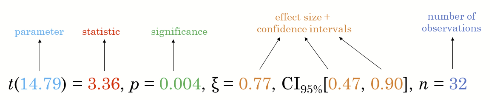
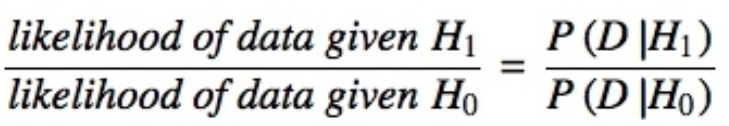

## **1. Learning Outcome**

::: callout-tip
### What I learned

In this hands-on exercise, I gained experience in:

-   Using **`ggstatsplot`** to create visualisations with rich statistical insights\
-   Applying **`performance`** to assess and visualise model diagnostics\
-   Using **`parameters`** to interpret and visualise model parameters\
:::

## **2. Visual Statistical Analysis with ggstatsplot**

[**ggstatsplot**](https://indrajeetpatil.github.io/ggstatsplot/index.html)  is an extension of [**ggplot2**](https://ggplot2.tidyverse.org/) package for creating graphics with details from statistical tests included in the information-rich plots themselves.

```         
-   To provide alternative statistical inference methods by default.
-   To follow best practices for statistical reporting. For all statistical tests reported in the plots, the default template abides by the [APA](https://my.ilstu.edu/~jhkahn/apastats.html) gold standard for statistical reporting. For example, here are results from a robust t-test:
```



## **3. Getting Started**

::: panel-tabset
### Installing and launching R packages

In this exercise, ggstatsplot and tidyverse will be used.

```{r}
pacman::p_load(ggstatsplot, tidyverse)
```

### Importing data

```{r}
exam <- read_csv("Hands-on Exercises/Hands-on W1/Exam_data.csv")
```
:::

### **3.1 One-sample test: *gghistostats()* method**

In the code chunk below, [*gghistostats()*](https://indrajeetpatil.github.io/ggstatsplot/reference/gghistostats.html) is used to to build an visual of one-sample test on English scores.

::: panel-tabset
### The plot

```{r}
#| echo: false

set.seed(1234)

gghistostats(
  data = exam,
  x = ENGLISH,
  type = "bayes",
  test.value = 60,
  xlab = "English scores"
)
```

### The code chunk

```{r}
#| eval: false

set.seed(1234)

gghistostats(
  data = exam,
  x = ENGLISH,
  type = "bayes",
  test.value = 60,
  xlab = "English scores"
)
```
:::

Default information: - statistical details - Bayes Factor - sample sizes - distribution summary

### **3.2 Unpacking the Bayes Factor**

-   A Bayes factor is the ratio of the likelihood of one particular hypothesis to the likelihood of another. It can be interpreted as a measure of the strength of evidence in favor of one theory among two competing theories.

-   That’s because the Bayes factor gives us a way to evaluate the data in favor of a null hypothesis, and to use external information to do so. It tells us what the weight of the evidence is in favor of a given hypothesis.

-   When we are comparing two hypotheses, H1 (the alternate hypothesis) and H0 (the null hypothesis), the Bayes Factor is often written as B10. It can be defined mathematically as



-   The [**Schwarz criterion**](https://www.statisticshowto.com/bayesian-information-criterion/) is one of the easiest ways to calculate rough approximation of the Bayes Factor.

### **3.3 How to interpret Bayes Factor**

A **Bayes Factor** can be any positive number. One of the most common interpretations is this one—first proposed by Harold Jeffereys (1961) and slightly modified by [Lee and Wagenmakers](https://www-tandfonline-com.libproxy.smu.edu.sg/doi/pdf/10.1080/00031305.1999.10474443?needAccess=true) in 2013:

| Bayes Factor | Interpretation |
|---|---|
| > 100 | Extreme evidence for H1 |
| 30 – 100 | Very strong evidence for H1 |
| 10 – 30 | Strong evidence for H1 |
| 3 – 10 | Moderate evidence for H1 |
| 1 – 3 | Anecdotal evidence for H1 |
| 1 | No evidence |
| 1/3 – 1 | Anecdotal evidence for H0 |
| 1/10 – 1/3 | Moderate evidence for H0 |
| 1/30 – 1/10 | Strong evidence for H0 |
| 1/100 – 1/30 | Very strong evidence for H0 |
| < 1/100 | Extreme evidence for H0 |

### **3.4 Two-sample mean test: *ggbetweenstats()***

In the code chunk below, [*ggbetweenstats()*](https://indrajeetpatil.github.io/ggstatsplot/reference/ggbetweenstats.html) is used to build a visual for two-sample mean test of Maths scores by gender.

::: panel-tabset
### The plot

```{r}
#| echo: false

ggbetweenstats(
  data = exam,
  x = RACE, 
  y = ENGLISH,
  type = "p",
  mean.ci = TRUE, 
  pairwise.comparisons = TRUE, 
  pairwise.display = "s",
  p.adjust.method = "fdr",
  messages = FALSE
)
```

### The code chunk

```{r}
#| eval: false

ggbetweenstats(
  data = exam,
  x = RACE, 
  y = ENGLISH,
  type = "p",
  mean.ci = TRUE, 
  pairwise.comparisons = TRUE, 
  pairwise.display = "s",
  p.adjust.method = "fdr",
  messages = FALSE
)
```
:::

-   “ns” → only non-significant

-   “s” → only significant

-   “all” → everything

#### 3.4.1 ggbetweenstats - Summary of tests

Following (between-subjects) tests are carried out for each type of analyses:

| **Type** | **No. of groups** | **Test** |
|---|---|---|
| Parametric | > 2 | Fisher's or Welch's one-way ANOVA |
| Non-parametric | > 2 | Kruskal–Wallis one-way ANOVA |
| Robust | > 2 | Heteroscedastic one-way ANOVA for trimmed means |
| Bayes Factor | > 2 | Fisher's ANOVA |
| Parametric | 2 | Student's or Welch's *t*-test |
| Non-parametric | 2 | Mann–Whitney *U* test |
| Robust | 2 | Yuen's test for trimmed means |
| Bayes Factor | 2 | Student's *t*-test |

Following effect sizes (and confidence intervals/CI) are available for each type of test:

| **Type** | **No. of groups** | **Effect size** | **CI?** |
|---|---|---|---|
| Parametric | > 2 | η²p, η², ω²p, ω² | Yes |
| Non-parametric | > 2 | η²H (H-statistic based eta-squared) | Yes |
| Robust | > 2 | ξ (Explanatory measure of effect size) | Yes |
| Bayes Factor | > 2 | No | No |
| Parametric | 2 | Cohen's *d*, Hedge's *g* (central- and noncentral-*t* distribution based) | Yes |
| Non-parametric | 2 | *r* (computed as Z/√N) | Yes |
| Robust | 2 | ξ (Explanatory measure of effect size) | Yes |
| Bayes Factor | 2 | No | No |

Here is a summary of *multiple pairwise comparison* tests supported in *ggbetweenstats*:

| **Type** | **Equal variance?** | **Test** | ***p*-value adjustment?** |
|---|---|---|---|
| Parametric | No | Games-Howell test | Yes |
| Parametric | Yes | Student's *t*-test | Yes |
| Non-parametric | No | Dunn test | Yes |
| Robust | No | Yuen's trimmed means test | Yes |
| Bayes Factor | NA | Student's *t*-test | NA |

### **3.5 Significant Test of Correlation: *ggscatterstats()***

In the code chunk below, [*ggscatterstats()*](https://indrajeetpatil.github.io/ggstatsplot/reference/ggscatterstats.html) is used to build a visual for Significant Test of Correlation between Maths scores and English scores.

```{r}
ggscatterstats(
  data = exam,
  x = MATHS,
  y = ENGLISH,
  marginal = FALSE
)
```

### **3.6 Significant Test of Association (Dependence): *ggbarstats()* methods**

In the code chunk below, the Maths scores is binned into a 4-class variable by using [*cut()*](https://www.rdocumentation.org/packages/base/versions/3.6.2/topics/cut).

```{r}
exam1 <- exam %>%
  mutate(MATHS_bins =
           cut(MATHS,
               breaks = c(0, 60, 75, 85, 100))
)
```

In this code chunk below, [*ggbarstats()*](https://indrajeetpatil.github.io/ggstatsplot/reference/ggbarstats.html) is used to build a visual for Significant Test of Association.

```{r}
ggbarstats(exam1,
           x = MATHS_bins,
           y = GENDER)
```


