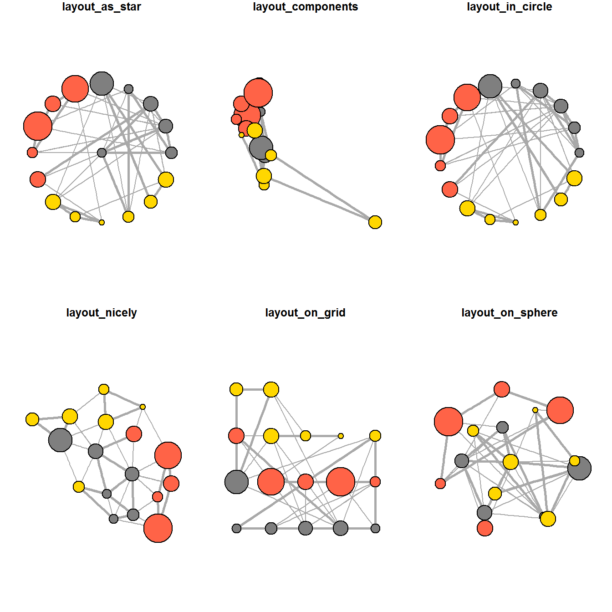

------------------------------------------------------------------------

## 1. Overview

In this hands-on exercise, I will learn how to model, analyse and visualise network data using R. By the end of this hands-on exercise, I will be able to:

-   create graph object data frames, manipulate them using appropriate functions of **dplyr**, **lubridate**, and **tidygraph**,
-   build network graph visualisations using appropriate functions of **ggraph**,
-   compute network geometrics using **tidygraph**,
-   build advanced graph visualisations by incorporating network geometrics, and
-   build interactive network visualisations using the **visNetwork** package.

## 2. Getting Started

::: panel-tabset
### Installing and loading the packages

For this exercise, four network data modelling and visualisation packages will be installed and launched: **igraph**, **tidygraph**, **ggraph**, and **visNetwork**. Beside these, **tidyverse**, **lubridate**, **graphlayouts**, **concaveman**, and **ggforce** will also be installed and loaded.

```{r}
pacman::p_load(igraph, tidygraph, ggraph,
               visNetwork, lubridate, clock,
               tidyverse, graphlayouts,
               concaveman, ggforce)
```

### The data

The datasets used in this exercise are from an oil exploration and extraction company. There are two datasets:

-   **GAStech-email_edges.csv** - contains two weeks of 9,063 email correspondences between 55 employees.
-   **GAStech_email_nodes.csv** - contains the names, departments, and titles of the 55 employees.
:::

## 3. The Data

### 3.1 Importing Network Data from Files

I will import `GAStech_email_node.csv` and `GAStech_email_edge-v2.csv` into R using `read_csv()` of the **readr** package.

```{r}
GAStech_nodes <- read_csv("Hands-on Exercises/Hands-on W7/GAStech_email_node.csv")
GAStech_edges <- read_csv("Hands-on Exercises/Hands-on W7/GAStech_email_edge-v2.csv")
```

### 3.2 Reviewing the Imported Data

I will examine the structure of the edges data frame using `glimpse()` of **dplyr**.

```{r}
glimpse(GAStech_edges)
```

::: callout-warning
The output above reveals that `SentDate` is treated as a **Character** data type instead of a **Date** data type. This is an error! I need to change the data type of `SentDate` back to Date before continuing.
:::

### 3.3 Wrangling Time

The code chunk below converts `SentDate` to proper Date format and adds a `Weekday` field.

```{r}
GAStech_edges <- GAStech_edges %>%
  mutate(SendDate = dmy(SentDate)) %>%
  mutate(Weekday = wday(SentDate,
                        label = TRUE,
                        abbr = FALSE))
```

::: callout-note
## Things to learn from the code chunk above

-   Both `dmy()` and `wday()` are functions of the **lubridate** package, which makes it easier to work with dates and times.
-   `dmy()` transforms the `SentDate` field to Date data type.
-   `wday()` returns the day of the week as a decimal number or an ordered factor if `label = TRUE`. With `abbr = FALSE`, day names are spelt in full (e.g., Monday). The result is stored in the new `Weekday` column.
-   The values in the `Weekday` field are in ordinal scale.
:::

### 3.4 Reviewing the Revised Date Fields

```{r}
glimpse(GAStech_edges)
```

### 3.5 Wrangling Attributes

The edges data frame currently consists of individual email flow records, which is not ideal for visualisation. I will aggregate the records by source, target, and day of the week, then compute a `Weight` field.

```{r}
GAStech_edges_aggregated <- GAStech_edges %>%
  filter(MainSubject == "Work related") %>%
  group_by(source, target, Weekday) %>%
    summarise(Weight = n()) %>%
  filter(source!=target) %>%
  filter(Weight > 1) %>%
  ungroup()
```

::: callout-note
## Things to learn from the code chunk above

-   Four functions from the **dplyr** package are used: `filter()`, `group_by()`, `summarise()`, and `ungroup()`.
-   The output data frame is called `GAStech_edges_aggregated`.
-   A new field called `Weight` has been added, representing the number of emails sent between each pair on a given weekday.
:::

### 3.6 Reviewing the Revised Edges File

```{r}
glimpse(GAStech_edges_aggregated)
```

## 4. Creating Network Objects Using tidygraph

In this section, I will create a graph data model using the **tidygraph** package. It provides a tidy API for graph/network manipulation by representing network data as two tidy tables - one for nodes and one for edges - and allows switching between them using **dplyr** verbs.

### 4.1 Using tbl_graph() to Build the tidygraph Data Model

I will use `tbl_graph()` of the **tidygraph** package to build a network graph data frame.

```{r}
GAStech_graph <- tbl_graph(nodes = GAStech_nodes,
                           edges = GAStech_edges_aggregated,
                           directed = TRUE)
```

### 4.2 Reviewing the Output tidygraph Object

```{r}
GAStech_graph
```

::: callout-note
## Things to learn from the output above

-   `GAStech_graph` is a `tbl_graph` object with 54 nodes and 1,372 edges.
-   The output prints the first six rows of Node Data and the first three rows of Edge Data.
-   The Node Data is marked as **active**. The notion of an active tibble within a `tbl_graph` object makes it possible to manipulate one tibble at a time.
:::

### 4.3 Changing the Active Object

The nodes tibble is activated by default. I can switch the active tibble using `activate()`. For example, to rearrange rows in the edges tibble by descending `Weight`:

```{r}
GAStech_graph %>%
  activate(edges) %>%
  arrange(desc(Weight))
```

## 5. Plotting Static Network Graphs with ggraph

**ggraph** is an extension of **ggplot2**, making it easier to carry over basic ggplot skills to network graph design. Every ggraph network graph has three main aspects: **nodes**, **edges**, and **layouts**.

### 5.1 Plotting a Basic Network Graph

The code chunk below uses `ggraph()`, `geom_edge_link()`, and `geom_node_point()` to plot a basic network graph.

```{r}
ggraph(GAStech_graph) +
  geom_edge_link() +
  geom_node_point()
```

::: callout-note
## Things to learn from the code chunk above

-   The basic plotting function is `ggraph()`, which takes the data and the desired layout type. It can accept either an **igraph** object or a **tbl_graph** object.
:::

### 5.2 Changing the Default Network Graph Theme

I will use `theme_graph()` to remove the x and y axes for a cleaner look.

```{r}
g <- ggraph(GAStech_graph) +
  geom_edge_link(aes()) +
  geom_node_point(aes())

g + theme_graph()
```

::: callout-note
## Things to learn from the code chunk above

-   `theme_graph()` removes axes, grids, and borders, and changes the font to Arial Narrow.
-   The ggraph theme can be set for a series of plots using `set_graph_style()` before plotting, or applied per plot using `theme_graph()`.
:::

### 5.3 Changing the Colouring of the Plot

`theme_graph()` also makes it easy to change the overall colour scheme of the plot.

```{r}
g <- ggraph(GAStech_graph) +
  geom_edge_link(aes(colour = 'grey50')) +
  geom_node_point(aes(colour = 'grey40'))

g + theme_graph(background = 'grey10',
                text_colour = 'white')
```

### 5.4 **Working with ggraph’s layouts**

**ggraph** support many layout for standard used, they are: star, circle, nicely (default), dh, gem, graphopt, grid, mds, spahere, randomly, fr, kk, drl and lgl. Figures below and on the right show layouts supported by `ggraph()`.



### 5.5 Fruchterman and Reingold Layout

The code chunk below plots the network graph using the Fruchterman and Reingold layout by setting `layout = "fr"`.

```{r}
g <- ggraph(GAStech_graph,
            layout = "fr") +
  geom_edge_link(aes()) +
  geom_node_point(aes())

g + theme_graph()
```

::: callout-note
## Things to learn from the code chunk above

-   The `layout` argument defines the layout algorithm to use. **ggraph** supports many layouts including: star, circle, nicely, dh, gem, graphopt, grid, mds, randomly, fr, kk, drl and lgl.
:::

### 5.5 Modifying Network Nodes

I will colour each node by its respective department.

```{r}
g <- ggraph(GAStech_graph,
            layout = "nicely") +
  geom_edge_link(aes()) +
  geom_node_point(aes(colour = Department,
                      size = 3))

g + theme_graph()
```

::: callout-note
## Things to learn from the code chunk above

-   `geom_node_point()` is equivalent in functionality to `geom_point()` of **ggplot2**. It allows for simple plotting of nodes in different shapes, colours and sizes.
:::

### 5.6 Modifying Edges

I will map the edge thickness to the `Weight` variable to show email volume.

```{r}
g <- ggraph(GAStech_graph,
            layout = "nicely") +
  geom_edge_link(aes(width=Weight),
                 alpha=0.2) +
  scale_edge_width(range = c(0.1, 5)) +
  geom_node_point(aes(colour = Department),
                  size = 3)

g + theme_graph()
```

::: callout-note
## Things to learn from the code chunk above

-   `geom_edge_link()` draws edges as straight lines between start and end nodes. The `width` argument maps line width proportionally to the `Weight` attribute, and `alpha` introduces opacity.
:::

## 6. Creating Facet Graphs

Faceting is a very useful feature in **ggraph** to reduce edge over-plotting by spreading nodes and edges out based on their attributes. There are three faceting functions:

-   `facet_nodes()` - edges are only drawn in a panel if both terminal nodes are present.
-   `facet_edges()` - nodes are always drawn in all panels.
-   `facet_graph()` - facets on two variables simultaneously.

### 6.1 Working with facet_edges()

```{r}
set_graph_style()

g <- ggraph(GAStech_graph,
            layout = "nicely") +
  geom_edge_link(aes(width=Weight),
                 alpha=0.2) +
  scale_edge_width(range = c(0.1, 5)) +
  geom_node_point(aes(colour = Department),
                  size = 2)

g + facet_edges(~Weekday)
```

### 6.2 Working with facet_edges() - Moving the Legend

I will use `theme()` to move the legend to the bottom.

```{r}
set_graph_style()

g <- ggraph(GAStech_graph,
            layout = "nicely") +
  geom_edge_link(aes(width=Weight),
                 alpha=0.2) +
  scale_edge_width(range = c(0.1, 5)) +
  geom_node_point(aes(colour = Department),
                  size = 2) +
  theme(legend.position = 'bottom')

g + facet_edges(~Weekday)
```

### 6.3 A Framed Facet Graph

I will use `th_foreground()` to add a frame border around each facet panel.

```{r}
set_graph_style()

g <- ggraph(GAStech_graph,
            layout = "nicely") +
  geom_edge_link(aes(width=Weight),
                 alpha=0.2) +
  scale_edge_width(range = c(0.1, 5)) +
  geom_node_point(aes(colour = Department),
                  size = 2)

g + facet_edges(~Weekday) +
  th_foreground(foreground = "grey80",
                border = TRUE) +
  theme(legend.position = 'bottom')
```

### 6.4 Working with facet_nodes()

```{r}
set_graph_style()

g <- ggraph(GAStech_graph,
            layout = "nicely") +
  geom_edge_link(aes(width=Weight),
                 alpha=0.2) +
  scale_edge_width(range = c(0.1, 5)) +
  geom_node_point(aes(colour = Department),
                  size = 2)

g + facet_nodes(~Department)+
  th_foreground(foreground = "grey80",
                border = TRUE) +
  theme(legend.position = 'bottom')
```

## 7. Network Metrics Analysis

### 7.1 Computing Centrality Indices

Centrality measures describe the relative importance of actors in a network. There are four well-known measures: degree, betweenness, closeness, and eigenvector.

I will use `centrality_betweenness()` of **tidygraph** to compute betweenness centrality and map it to node size.

```{r}
g <- GAStech_graph %>%
  mutate(betweenness_centrality = centrality_betweenness()) %>%
  ggraph(layout = "fr") +
  geom_edge_link(aes(width=Weight),
                 alpha=0.2) +
  scale_edge_width(range = c(0.1, 5)) +
  geom_node_point(aes(colour = Department,
            size=betweenness_centrality))
g + theme_graph()
```

### 7.2 Visualising Network Metrics

The code below computes centrality directly inside the `aes()` call.

```{r}
g <- GAStech_graph %>%
  ggraph(layout = "fr") +
  geom_edge_link(aes(width=Weight),
                 alpha=0.2) +
  scale_edge_width(range = c(0.1, 5)) +
  geom_node_point(aes(colour = Department,
                      size = centrality_betweenness()))
g + theme_graph()
```

### 7.3 Visualising Community

I will use `group_edge_betweenness()` to detect communities and colour nodes accordingly.

```{r}
g <- GAStech_graph %>%
  mutate(community = as.factor(
    group_edge_betweenness(
      weights = Weight,
      directed = TRUE))) %>%
  ggraph(layout = "fr") +
  geom_edge_link(
    aes(
      width=Weight),
    alpha=0.2) +
  scale_edge_width(
    range = c(0.1, 5)) +
  geom_node_point(
    aes(colour = community))

g + theme_graph()
```

I will now enhance the community visualisation by adding convex hull boundaries around each community using `geom_mark_hull()` of the **ggforce** package, and using `group_optimal()` for community detection.

```{r}
g <- GAStech_graph %>%
  activate(nodes) %>%
  mutate(community = as.factor(
    group_optimal(weights = Weight)),
         betweenness_measure = centrality_betweenness()) %>%
  ggraph(layout = "fr") +
  geom_mark_hull(
    aes(x, y,
        group = community,
        fill = community),
    alpha = 0.2,
    expand = unit(0.3, "cm"),
    radius = unit(0.3, "cm")
  ) +
  geom_edge_link(aes(width=Weight),
                 alpha=0.2) +
  scale_edge_width(range = c(0.1, 5)) +
  geom_node_point(aes(fill = Department,
                      size = betweenness_measure),
                      color = "black",
                      shape = 21)

g + theme_graph()
```

## 8. Building Interactive Network Graph with visNetwork

**visNetwork** uses a nodes list and edges list to create an interactive network. The nodes list must include an `id` column, and the edges list must have `from` and `to` columns.

### 8.1 Data Preparation

I will prepare the edges data to use `from` and `to` columns (required by **visNetwork**) by joining with the nodes data.

```{r}
GAStech_edges_aggregated <- GAStech_edges %>%
  left_join(GAStech_nodes, by = c("sourceLabel" = "label")) %>%
  rename(from = id) %>%
  left_join(GAStech_nodes, by = c("targetLabel" = "label")) %>%
  rename(to = id) %>%
  filter(MainSubject == "Work related") %>%
  group_by(from, to) %>%
    summarise(weight = n()) %>%
  filter(from!=to) %>%
  filter(weight > 1) %>%
  ungroup()
```

### 8.2 Plotting the First Interactive Network Graph

```{r}
visNetwork(GAStech_nodes,
           GAStech_edges_aggregated)
```

### 8.3 Working with Layout

I will use `visIgraphLayout()` to apply the Fruchterman-Reingold layout.

```{r}
visNetwork(GAStech_nodes,
           GAStech_edges_aggregated) %>%
  visIgraphLayout(layout = "layout_with_fr")
```

### 8.4 Working with Visual Attributes - Nodes

**visNetwork** looks for a `group` column in the nodes data frame to colour nodes automatically. I will rename `Department` to `group`.

```{r}
GAStech_nodes <- GAStech_nodes %>%
  rename(group = Department)
```

I will now re-plot with the legend added.

```{r}
visNetwork(GAStech_nodes,
           GAStech_edges_aggregated) %>%
  visIgraphLayout(layout = "layout_with_fr") %>%
  visLegend() %>%
  visLayout(randomSeed = 123)
```

### 8.5 Working with Visual Attributes - Edges

I will use `visEdges()` to add directional arrows and curved edges.

```{r}
visNetwork(GAStech_nodes,
           GAStech_edges_aggregated) %>%
  visIgraphLayout(layout = "layout_with_fr") %>%
  visEdges(arrows = "to",
           smooth = list(enabled = TRUE,
                         type = "curvedCW")) %>%
  visLegend() %>%
  visLayout(randomSeed = 123)
```

### 8.6 Interactivity

I will use `visOptions()` to add interactive features: highlighting nearest nodes and a node ID selection dropdown.

```{r}
visNetwork(GAStech_nodes,
           GAStech_edges_aggregated) %>%
  visIgraphLayout(layout = "layout_with_fr") %>%
  visOptions(highlightNearest = TRUE,
             nodesIdSelection = TRUE) %>%
  visLegend() %>%
  visLayout(randomSeed = 123)
```

## 9. Reference

-   Pedersen, T.L. (2022). [*ggraph: An Implementation of Grammar of Graphics for Graphs and Networks*](https://ggraph.data-imaginist.com/).
-   Pedersen, T.L. (2022). [*tidygraph: A Tidy API for Graph Manipulation*](https://tidygraph.data-imaginist.com/).
-   Almende B.V. (2022). [*visNetwork: Network Visualization using 'vis.js' Library*](https://datastorm-open.github.io/visNetwork/).
