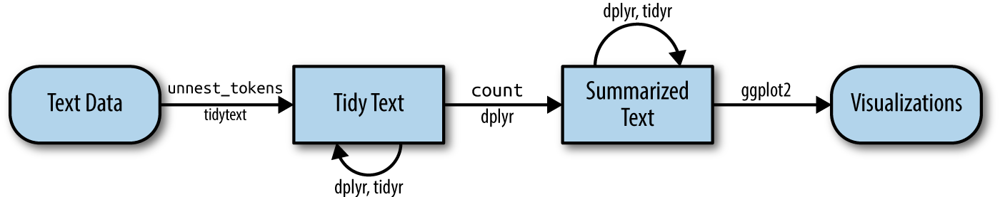
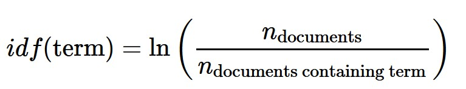
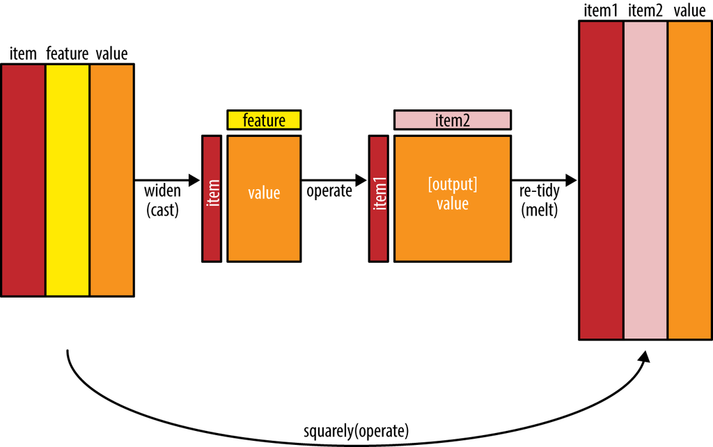

------------------------------------------------------------------------

## 1. Learning Outcome

In this hands-on exercise, I will learn how to visualise and analyse text data using R. By the end of this hands-on exercise, I will be able to:

-   understand the **tidytext** framework for processing, analysing and visualising text data,
-   write a function for importing multiple files into R,
-   combine multiple files into a single data frame,
-   clean and wrangle text data by using a **tidyverse** approach,
-   visualise words with Word Cloud,
-   compute term frequency–inverse document frequency (TF-IDF) using **tidytext** methods, and
-   visualise texts and terms relationships.

## 2. Getting Started

::: panel-tabset
### Installing and loading the packages

For this exercise, the following R packages for handling, processing, wrangling, analysing and visualising text data will be used:

-   **tidytext** and **tidyverse** (mainly readr, purrr, stringr, ggplot2),
-   **widyr**,
-   **wordcloud** and **ggwordcloud**,
-   **textplot** (which requires igraph, tidygraph and ggraph),
-   **DT**, and
-   **lubridate** and **hms**.

The code chunk below installs and loads all required packages into the R environment.

```{r}
pacman::p_load(tidytext, widyr, wordcloud, DT, ggwordcloud, textplot, lubridate, hms,
               tidyverse, tidygraph, ggraph, igraph)
```

### Reading the data

For this exercise, I will use the **20 Newsgroups** dataset. It consists of approximately 20,000 newsgroup messages partitioned across 20 different newsgroups.

The raw data is stored in the `data/20news/` sub-folder. I will import and process it in **Section 4** below, then read the saved RDS file going forward.
:::

## 3. Importing Multiple Text Files from Multiple Folders

### 3.1 Creating a Folder List

I will first define the path to the 20 newsgroups dataset folder.

```{r}
news20 <- "Hands-on Exercises/Hands-on W7/20news"
```

### 3.2 Defining a Function to Read All Files from a Folder into a Data Frame

Next, I will define a `read_folder()` function that reads all text files from a given folder into a data frame.

```{r}
read_folder <- function(infolder) {
  tibble(file = dir(infolder,
                    full.names = TRUE)) %>%
    mutate(text = map(file,
                      read_lines)) %>%
    transmute(id = basename(file),
              text) %>%
    unnest(text)
}
```

## 4. Reading in All the Messages from the 20news Folder

Using `read_folder()`, I will now read all messages from every newsgroup sub-folder, combine them into a single data frame, and save the result as an RDS file for future use.

```{r}
raw_text <- tibble(folder =
                     dir(news20,
                         full.names = TRUE)) %>%
  mutate(folder_out = map(folder,
                          read_folder)) %>%
  unnest(cols = c(folder_out)) %>%
  transmute(newsgroup = basename(folder),
            id, text)
write_rds(raw_text, "Hands-on Exercises/Hands-on W7/news20.rds")
```

::: callout-note
## Things to learn from the code chunk above

-   `read_lines()` of the **readr** package is used to read up to `n_max` lines from a file.
-   `map()` of the **purrr** package transforms input by applying a function to each element of a list and returns an object of the same length as the input.
-   `unnest()` of the **dplyr** package flattens a list-column of data frames back out into regular columns.
-   `mutate()` of **dplyr** adds new variables while preserving existing ones.
-   `transmute()` of **dplyr** adds new variables while dropping existing ones.
-   `write_rds()` saves the extracted and combined data frame as an RDS file for future use.
:::

## 5. Initial EDA

I will load the saved RDS file and visualise the frequency of messages by newsgroup.

```{r}
raw_text <- read_rds("Hands-on Exercises/Hands-on W7/news20.rds")
raw_text %>%
  group_by(newsgroup) %>%
  summarize(messages = n_distinct(id)) %>%
  ggplot(aes(messages, newsgroup)) +
  geom_col(fill = "lightblue") +
  labs(y = NULL)
```

## 6. Introducing tidytext

By using tidy data principles for text data, I can take advantage of the existing infrastructure in packages like **dplyr**, **broom**, **tidyr**, and **ggplot2**.



### 6.1 Removing Header and Automated Email Signatures

Each message contains structure I don't want in my analysis — headers (fields like "from:" or "in_reply_to:") and automated email signatures (after a line like "––"). The code chunk below removes these.

```{r}
cleaned_text <- raw_text %>%
  group_by(newsgroup, id) %>%
  filter(cumsum(text == "") > 0,
         cumsum(str_detect(
           text, "^--")) == 0) %>%
  ungroup()
```

::: callout-note
## Things to learn from the code chunk

-   `cumsum()` of base R returns a vector whose elements are the cumulative sums of the elements of the argument.
-   `str_detect()` from **stringr** detects the presence or absence of a pattern in a string.
:::

### 6.2 Removing Lines with Nested Text Representing Quotes from Other Users

Next, I will use regular expressions to remove lines containing quoted text from other users.

```{r}
cleaned_text <- cleaned_text %>%
  filter(str_detect(text, "^[^>]+[A-Za-z\\d]")
         | text == "",
         !str_detect(text,
                     "writes(:|\\.\\.\\.)$"),
         !str_detect(text,
                     "^In article <")
  )
```

::: callout-note
## Things to learn from the code chunk

-   `str_detect()` from **stringr** detects the presence or absence of a pattern in a string.
-   `filter()` of the **dplyr** package subsets a data frame, retaining all rows that satisfy the specified conditions.
:::

### 6.3 Text Data Processing

In the code chunk below, `unnest_tokens()` of the **tidytext** package is used to split the dataset into tokens, while `stop_words` is used to remove stop words.

```{r}
usenet_words <- cleaned_text %>%
  unnest_tokens(word, text) %>%
  filter(str_detect(word, "[a-z']$"),
         !word %in% stop_words$word)
```

Now that I've removed the headers, signatures, and formatting, I can start exploring common words. I will first find the most common words in the entire dataset.

```{r}
usenet_words %>%
  count(word, sort = TRUE)
```

I can also count words within each newsgroup separately.

```{r}
words_by_newsgroup <- usenet_words %>%
  count(newsgroup, word, sort = TRUE) %>%
  ungroup()
```

### 6.4 Visualising Words in Newsgroups — Static Word Cloud

In the code chunk below, `wordcloud()` of the **wordcloud** package is used to plot a static word cloud.

```{r}
wordcloud(words_by_newsgroup$word,
          words_by_newsgroup$n,
          max.words = 300)
```

### 6.5 Visualising Words in Newsgroups — ggwordcloud

I will now use the **ggwordcloud** package to create faceted word clouds, one per newsgroup.

```{r}
set.seed(1234)

words_by_newsgroup %>%
  filter(n > 0) %>%
ggplot(aes(label = word,
           size = n)) +
  geom_text_wordcloud() +
  theme_minimal() +
  facet_wrap(~newsgroup)
```

## 7. Basic Concept of TF-IDF

TF-IDF (term frequency–inverse document frequency) is a numerical statistic that reflects how important a word is to a document within a collection or corpus.



### 7.1 Computing TF-IDF within Newsgroups

The code chunk below uses `bind_tf_idf()` of the **tidytext** package to compute and bind the term frequency, inverse document frequency, and TF-IDF values to the dataset.

```{r}
tf_idf <- words_by_newsgroup %>%
  bind_tf_idf(word, newsgroup, n) %>%
  arrange(desc(tf_idf))
```

### 7.2 Visualising TF-IDF as an Interactive Table

I will use `datatable()` of the **DT** package to create an interactive HTML table.

```{r}
DT::datatable(tf_idf, filter = 'top') %>%
  formatRound(columns = c('tf', 'idf',
                          'tf_idf'),
              digits = 3) %>%
  formatStyle(0,
              target = 'row',
              lineHeight='25%')
```

::: callout-note
## Things to learn from the code chunk

-   The `filter` argument controls the filter UI in the rendered table.
-   `formatRound()` customises the value format; the `digits` argument defines the number of decimal places.
-   `formatStyle()` customises the output table. Here, `target` and `lineHeight` reduce the row height by 25%.
:::

### 7.3 Visualising TF-IDF within Newsgroups

I will use facet bar charts to visualise the top TF-IDF terms for science-related newsgroups.

```{r}
tf_idf %>%
  filter(str_detect(newsgroup, "^sci\\.")) %>%
  group_by(newsgroup) %>%
  slice_max(tf_idf,
            n = 12) %>%
  ungroup() %>%
  mutate(word = reorder(word,
                        tf_idf)) %>%
  ggplot(aes(tf_idf,
             word,
             fill = newsgroup)) +
  geom_col(show.legend = FALSE) +
  facet_wrap(~ newsgroup,
             scales = "free") +
  labs(x = "tf-idf",
       y = NULL)
```

### 7.4 Counting and Correlating Pairs of Words with widyr

To see how correlated newsgroups are based on the words they share, I will use `pairwise_cor()` of the **widyr** package. The **widyr** package first casts a tidy dataset into a wide matrix, performs the operation (e.g., correlation), then re-tidies the result.



```{r}
newsgroup_cors <- words_by_newsgroup %>%
  pairwise_cor(newsgroup,
               word,
               n,
               sort = TRUE)
```

### 7.5 Visualising Correlation as a Network

I will now visualise the relationships between newsgroups in a network graph using `graph_from_data_frame()` of **igraph** and `ggraph()`.

```{r}
set.seed(2017)

newsgroup_cors %>%
  filter(correlation > .025) %>%
  graph_from_data_frame() %>%
  ggraph(layout = "fr") +
  geom_edge_link(aes(alpha = correlation,
                     width = correlation)) +
  geom_node_point(size = 6,
                  color = "lightblue") +
  geom_node_text(aes(label = name),
                 color = "red",
                 repel = TRUE) +
  theme_void()
```

### 7.6 Bigrams

I will now analyse word pairs (bigrams) using `unnest_tokens()` of **tidytext** with `token = "ngrams"` and `n = 2`.

```{r}
bigrams <- cleaned_text %>%
  unnest_tokens(bigram,
                text,
                token = "ngrams",
                n = 2)
bigrams
```

### 7.7 Counting Bigrams

I will count and sort the bigrams.

```{r}
bigrams_count <- bigrams %>%
  filter(bigram != 'NA') %>%
  count(bigram, sort = TRUE)
bigrams_count
```

### 7.8 Cleaning Bigrams

I will separate each bigram into two individual words and filter out stop words from both.

```{r}
bigrams_separated <- bigrams %>%
  filter(bigram != 'NA') %>%
  separate(bigram, c("word1", "word2"),
           sep = " ")

bigrams_filtered <- bigrams_separated %>%
  filter(!word1 %in% stop_words$word) %>%
  filter(!word2 %in% stop_words$word)
bigrams_filtered
```

### 7.9 Counting Bigrams Again

After cleaning, I will recount the bigrams to get meaningful word pair frequencies.

```{r}
bigram_counts <- bigrams_filtered %>%
  count(word1, word2, sort = TRUE)
```

### 7.10 Creating a Network Graph from Bigram Data Frame

I will create a directed network graph from the bigram counts using `graph_from_data_frame()` of the **igraph** package.

```{r}
bigram_graph <- bigram_counts %>%
  filter(n > 3) %>%
  graph_from_data_frame()
bigram_graph
```

### 7.11 Visualising a Network of Bigrams with ggraph

I will plot a basic network visualisation of the bigrams.

```{r}
set.seed(1234)

ggraph(bigram_graph, layout = "fr") +
  geom_edge_link() +
  geom_node_point() +
  geom_node_text(aes(label = name),
                 vjust = 1,
                 hjust = 1)
```

### 7.12 Revised Version

Finally, I will create a more polished version of the bigram network graph by adding directional arrows and visual styling.

```{r}
set.seed(1234)

a <- grid::arrow(type = "closed",
                 length = unit(.15,
                               "inches"))

ggraph(bigram_graph,
       layout = "fr") +
  geom_edge_link(aes(edge_alpha = n),
                 show.legend = FALSE,
                 arrow = a,
                 end_cap = circle(.07,
                                  'inches')) +
  geom_node_point(color = "lightblue",
                  size = 5) +
  geom_node_text(aes(label = name),
                 vjust = 1,
                 hjust = 1) +
  theme_void()
```

## 8. References

-   Silge, J. & Robinson, D. (2017). [*Text Mining with R: A Tidy Approach*](https://www.tidytextmining.com/). O'Reilly Media.
-   [tidytext: Text Mining using Tidy Data Principles](https://juliasilge.github.io/tidytext/)
-   [widyr: Widen, Process, then Re-Tidy Data](https://cran.r-project.org/web/packages/widyr/)
