## Contents {.toc-slide}

::: toc-header
Motor Vehicle Insurance Portfolio — Visual Analytics Insights
:::

| Slide | Topic                                                 | Theme         |
|:----------:|:-------------------------------------------|:-----------|
|   3   | Insight 1 — Portfolio Composition & Bonus Profile     | Exposure      |
|   4   | Insight 2 — Exposure Base: Geography & Vehicle Brand  | Exposure      |
|   5   | Insight 3 — Premium Distribution & Coverage Mix       | Pricing       |
|   6   | Insight 4 — Loss Ratio Overview & Tail Concentration  | Profitability |
|   7   | Insight 5 — Profitability by Policy Type              | Profitability |
|   8   | Insight 6 — Bonus-Malus System Validation             | Risk Rating   |
|   9   | Insight 7 — Driver Age Risk Profile                   | Risk Rating   |
|  10   | Insight 8 — Geographic Risk & Territorial Volatility  | Geography     |
|  11   | Insight 9 — Vehicle Value & Coverage Interaction      | Severity      |
|  12   | Insight 10 — Claim Severity & Product Volatility      | Severity      |
|  13   | Insight 11 — Large-Loss Layers & Funnel Analysis      | Tail Risk     |
|  14   | Insight 12 — Temporal, Flow & Adjusted Risk Synthesis | Synthesis     |
|  15   | Conclusions & Managerial Recommendations              | —             |

::: notes
This executive summary presents 12 visual analytics insights from a Spanish motor insurance portfolio of approximately 354,000 policy-year records spanning 2022 to 2024. Analysis covers portfolio composition, risk profiling, profitability, volatility drivers, and temporal trends. All group comparisons use non-parametric statistical tests appropriate for right-skewed insurance data. Slide 14 presents two bonus visual analytics techniques — alluvial flow and adjusted odds ratios — that go beyond standard course methods. Key findings and actionable recommendations are consolidated on the final slide.
:::

------------------------------------------------------------------------

::: insight-label
**INSIGHT #1 (POLICY COMPOSITION):**
:::

::: insight-title
CC AND COMP COVERS DOMINATE; NEW-BUSINESS BIAS AND BONUS CONCENTRATION REQUIRE CAREFUL INTERPRETATION
:::

::::: columns
::: {.column width="50%"}
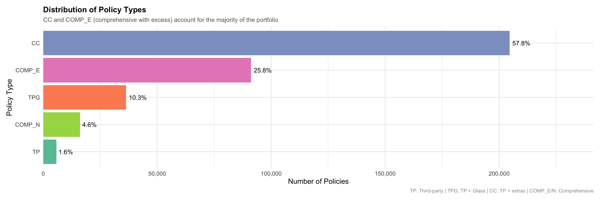
:::

::: {.column width="50%"}
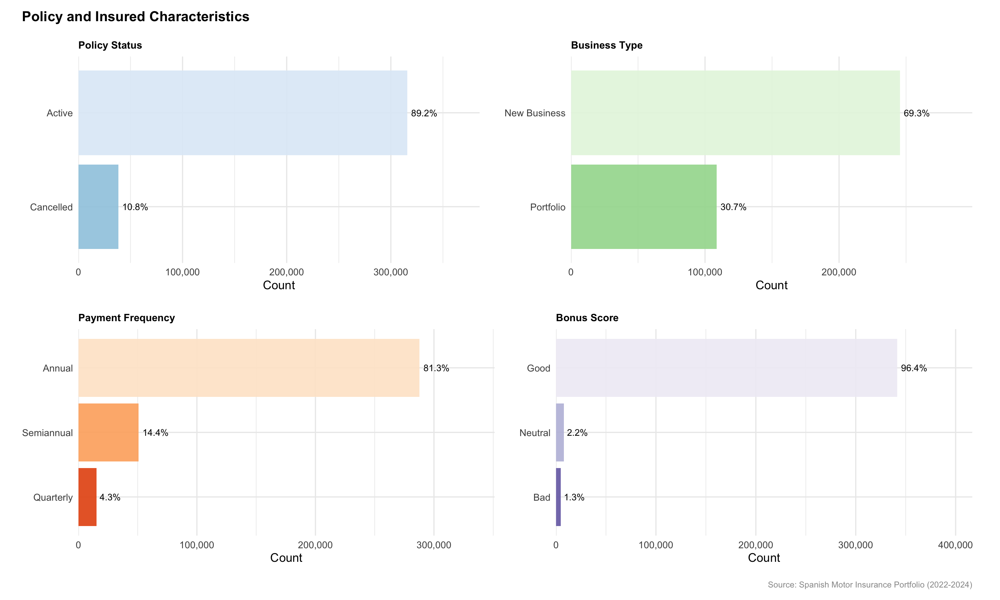
:::
:::::

::: context
**Portfolio composition reveals structural biases that distort aggregate metrics if not explicitly corrected. Two imbalances, new-business dominance and near-universal Good bonus, are analytically critical before any loss-ratio comparison is made.**
:::

-   **CC and COMP_E/N dominate** by policy count: product-level profitability analysis is more informative than total portfolio averages; pooling across covers masks pricing adequacy signals
-   **89.2% active, 81.3% annual payment**: Operationally stable, but annual payment concentration creates a single adverse-selection gate at renewal each year
-   **69.3% new business**: Policies without renewal filtering systematically overstate attritional loss experience; aggregate LR is an upper bound for mature-book performance, not a steady-state estimate
-   **96.4% Good bonus**: Near-uniform tier creates statistical fragility; Neutral and Bad segment results lack credibility and must not be used as pricing relativities without exposure-credibility weighting
-   **Implication:** Compositional bias must be corrected analytically before attributing LR differences to product risk; direct comparisons across bonus tiers or business-type splits will mislead without adjustment

::: notes
The portfolio is dominated by CC and comprehensive covers. The most important risk flag is the 69.3% new-business proportion, these policies have not yet been through renewal filtering, so their loss experience systematically overstates long-run claims cost. Annual payment dominance concentrates lapse and adverse-selection risk at a single point in the year. The near-universal Good bonus score creates statistical fragility in tier comparisons; any loss-ratio difference between Good, Neutral, and Bad segments should be tested for credibility before becoming a pricing input.
:::

------------------------------------------------------------------------

::: insight-label
**INSIGHT #2 (EXPOSURE BASE):**
:::

::: insight-title
URBAN EXPOSURE IS MATERIAL; BRAND CONCENTRATION IN SEVEN CORE MANUFACTURERS DRIVES PORTFOLIO OUTCOMES
:::

::::: columns
::: {.column width="42%"}
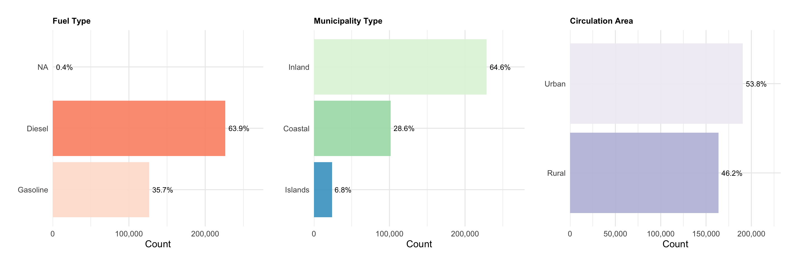
:::

::: {.column width="58%"}
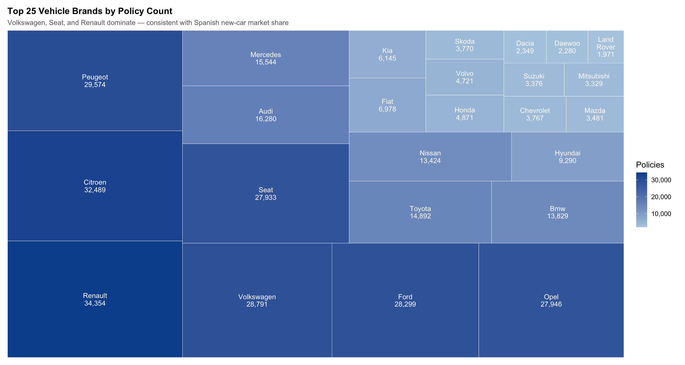
:::
:::::

::: context
**Where exposure sits geographically and by brand predetermines which loss drivers are active. Both dimensions reveal concentration patterns that must frame how territorial and brand-level results are interpreted in later slides.**
:::

-   **Urban circulation dominant**: Higher traffic density translates directly into elevated claim frequency; geographic LR comparisons in subsequent slides should be read through this urban-bias lens
-   **Island exposure smaller and more volatile**: Raw Island LR rankings reflect thin exposure producing wide confidence intervals, not persistent structural risk; direct conversion to a territorial loading would be misleading
-   **Seven core brands (Renault, Citroën, Peugeot, VW, Ford, Opel, Seat)** form the mass-market book: Severity trends in this group drive aggregate portfolio outcomes and warrant first-priority monitoring
-   **Premium brands (Mercedes, Audi, BMW)** are present but thin, higher per-vehicle repair costs can produce severity outliers disproportionate to their policy count
-   **Fuel mix** is predominantly gasoline/diesel; growing electric and hybrid exposure needs separate severity monitoring given structurally different repair cost profiles

::: notes
Urban circulation dominance explains why geographic effects will appear in later loss-ratio comparisons. The treemap confirms a mass-market exposure base without single-manufacturer concentration risk. The seven core manufacturers drive portfolio results; any systematic claim or severity trend in these brands will materially affect aggregate outcomes. Premium brands present a monitoring need despite their smaller share — their higher per-vehicle repair costs can produce severity outliers even at low frequency. Territory and brand should be treated as investigation triggers with credibility-weighted pricing implications, not as direct rating inputs.
:::

------------------------------------------------------------------------

::: insight-label
**INSIGHT #3 (PREMIUM & COVERAGE STRUCTURE):**
:::

::: insight-title
BIMODAL PREMIUM REVEALS TWO DISTINCT RISK SEGMENTS; LIABILITY DOMINATES BOTH PREMIUM AND INCURRED LOSSES
:::

::::: columns
::: {.column width="50%"}
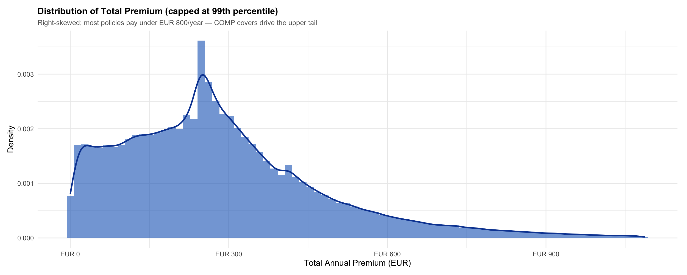
:::

::: {.column width="50%"}
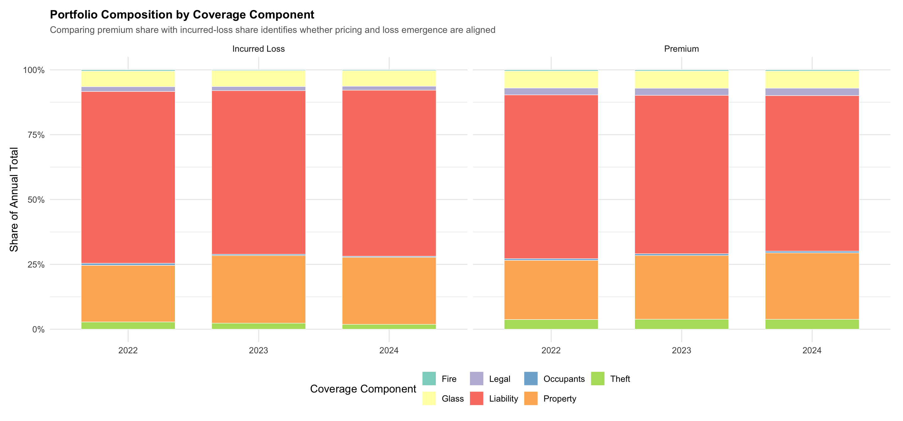
:::
:::::

::: context
**The premium distribution and component breakdown reveal that the portfolio is not economically homogeneous. Two distinct sub-books co-exist with fundamentally different claims economics, and their diverging component loss shares signal early pricing-lag risk.**
:::

-   **Near-bimodal premium shape:** Low-premium mass (under EUR 300) and a high-premium COMP tail indicate two distinct risk pools, pooled pricing assumptions create cross-subsidisation and mask diverging profitability trends
-   **Frequency vs. severity sensitivity differs:** Low-premium TP/CC policies are frequency-sensitive; high-premium COMP policies are severity-sensitive, aggregate pricing models will systematically misallocate risk loads between the two books
-   **Liability and property dominate** both written premium and incurred losses consistently across 2022–2024, these components are the core portfolio value drivers
-   **Incurred mix drifts more than premium mix**: Component loss shares show greater year-on-year variation than premium shares, indicating that pricing is already lagging emerging loss trends before it surfaces in total LR
-   **Management implication:** Monitor component-level loss ratios separately from total LR, component drift is an earlier and more granular pricing-adequacy warning signal

::: notes
The near-bimodal premium distribution is strategically important. Managing a low-premium frequency book and a high-premium severity book with the same aggregate pricing assumptions creates cross-subsidisation risk and masks diverging trends. The component chart confirms liability and property as the core value drivers. A consistent finding across 2022–2024 is that incurred-loss component shares show slightly more year-on-year variation than premium shares. This subtle misalignment is where pricing lag typically originates, early monitoring of component loss ratios, not only the total, is the correct management response.
:::

------------------------------------------------------------------------

::: insight-label
**INSIGHT #4 (LOSS RATIO OVERVIEW & TAIL RISK):**
:::

::: insight-title
PORTFOLIO PROFITABLE AT \~70% AGGREGATE LR, BUT TOP CLAIM-BEARING ROWS DRIVE THE MAJORITY OF INCURRED LOSSES
:::

::::: columns
::: {.column width="50%"}
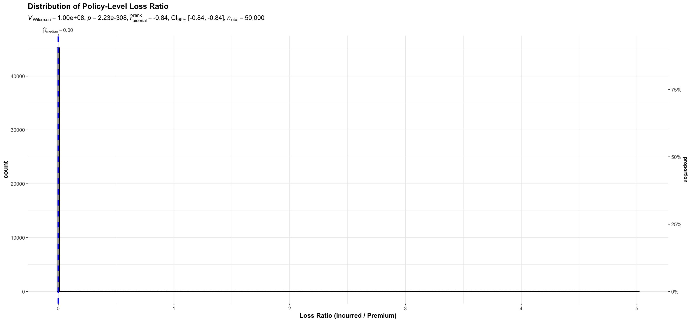
:::

::: {.column width="50%"}
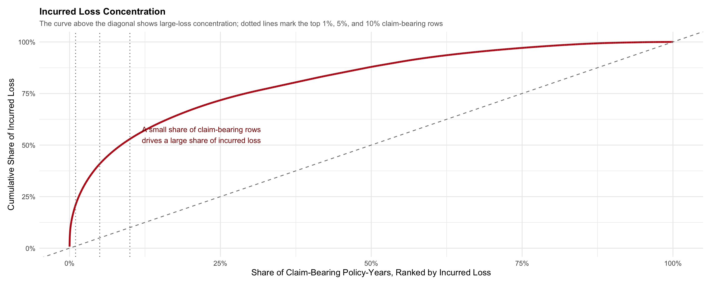
:::
:::::

::: context
**Aggregate profitability and tail-risk concentration are separate, coexisting facts. A sub-100% aggregate loss ratio does not imply resilience to large claims, this slide establishes both as the central analytical tension in the portfolio.**
:::

-   **Aggregate LR \~70%:** Wilcoxon signed-rank test confirms median policy-year LR is significantly below break-even (p \< 0.001), the portfolio is currently profitable at the aggregate level
-   **Zero inflation:** The spike at LR = 0 reflects the no-claim majority; median policy LR understates true portfolio performance, **aggregate LR** is the correct profitability metric, not median
-   **Pareto concentration:** Lorenz curve lies far above the equality diagonal, a small proportion of claim-bearing policy-years generates a disproportionate share of total incurred loss
-   **Profitability ≠ stability:** Aggregate LR of \~70% is fully compatible with meaningful earnings volatility if large losses cluster in a single underwriting year
-   **Implication:** Pricing teams protect the profitable attritional base; reserving and reinsurance teams focus on the concentrated tail, these are separate, simultaneous management imperatives

::: notes
Two structural features define this portfolio: zero-inflated base and a heavy right tail. The aggregate LR confirms profitability; the Pareto curve confirms retained volatility. These are separate management problems. Pricing teams should protect the profitable attritional base. Reserving and reinsurance teams should focus on which products and layers produce the largest tail contribution. A below-100% aggregate LR must not reduce vigilance about large-loss monitoring, the two facts are compatible. This is the central tension that runs through all subsequent analysis.
:::

------------------------------------------------------------------------

::: insight-label
**INSIGHT #5 (PROFITABILITY BY POLICY TYPE):**
:::

::: insight-title
COMP_N HAS THE HIGHEST AGGREGATE LOSS RATIO; DISTRIBUTION SHAPES REVEAL DIFFERENT RESERVING NEEDS ACROSS COVERS
:::

::::: columns
::: {.column width="50%"}
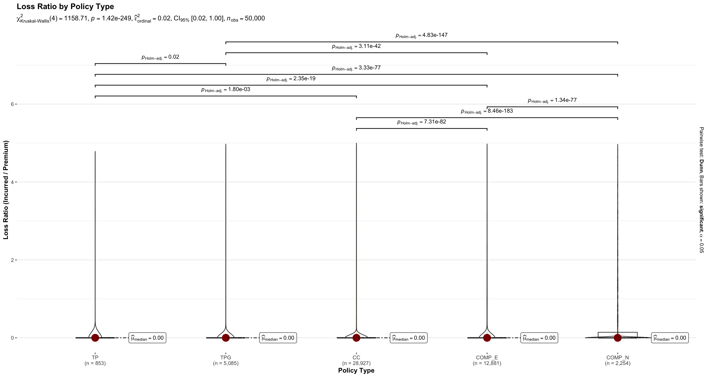
:::

::: {.column width="50%"}
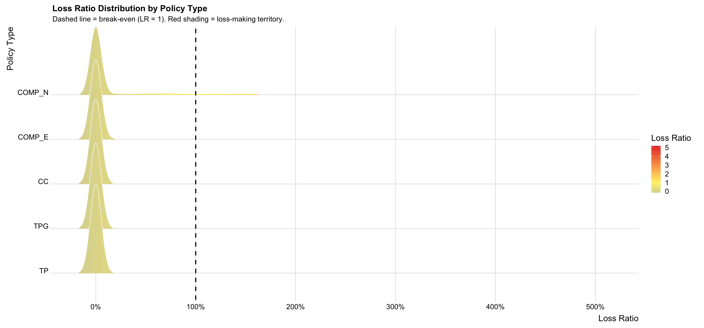
:::
:::::

::: context
**Loss-ratio differences across policy types are confirmed statistically and reveal not just which products are most adverse, but how their distribution shapes imply structurally different reserving requirements, mean LR alone is insufficient.**
:::

-   **Kruskal-Wallis test** confirms LR distributions differ significantly across all policy types (p \< 0.001), product type is a genuine discriminator, not statistical noise from volume differences
-   **COMP_N most adverse:** Highest aggregate LR, likely reflecting underpricing for retained own-damage exposure, weak excess/deductible controls, or adverse vehicle-value mix within the product
-   **Tail weight differs markedly:** COMP_E and COMP_N show heavier upper tails (LR \> 1) than TP/CC, more policy-years are genuinely loss-making, not merely high-attritional
-   **TP and TPG tight and predictable:** Lower dispersion means reserve uncertainty is limited; these products need less tail-loading than COMP covers
-   **Reserving implication:** Policy types with similar mean LR but different distribution shapes require different reserve margins, applying a uniform margin across all covers systematically underestimates COMP volatility and misallocates capital

::: notes
The Kruskal-Wallis test confirms statistically significant product-level LR differences. The ridgeline gradient adds shape information the statistical test cannot show: COMP covers have heavier tails in loss-making territory. TP and TPG are tight and predictable. CC, the dominant volume class, sits in the middle. The critical reserving message is that tail weight, not just mean LR, determines the required reserve margin. COMP_N warrants a specific pricing review before next renewal given the combination of highest aggregate LR and heaviest upper tail. Pooling COMP and TP in aggregate reserve calculations will systematically understate COMP volatility.
:::

------------------------------------------------------------------------

::: insight-label
**INSIGHT #6 (BONUS-MALUS VALIDATION):**
:::

::: insight-title
BONUS SCORE DISCRIMINATES CLAIM OCCURRENCE EFFECTIVELY; SIGNAL IS STRONGER FOR FREQUENCY THAN FOR AGGREGATE LOSS RATIO
:::

::::: columns
::: {.column width="50%"}
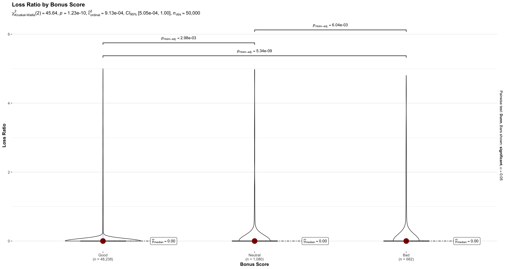
:::

::: {.column width="50%"}
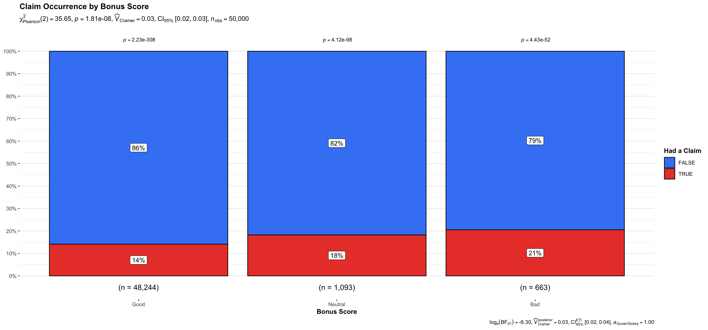
:::
:::::

::: context
**The bonus-malus system is the portfolio's primary behavioural risk discriminator. Its actuarial validity — both for frequency discrimination and loss-ratio ordering — is tested directly against observed data across all three tiers.**
:::

-   **Kruskal-Wallis + pairwise Dunn tests** confirm all three bonus tiers differ significantly in LR distributions (p \< 0.001), statistically valid as a rating variable, not a nominal classification
-   **Chi-square test** confirms significantly different claim occurrence rates across tiers — Good tier carries the lowest claim probability, validating the system's core purpose
-   **Not perfectly monotonic:** Neutral sometimes shows higher aggregate LR than Bad due to severity composition differences, the bonus signal is cleaner for frequency than for aggregate LR and should be applied as a frequency modifier
-   **Credibility constraint:** Thin Neutral and Bad exposure means raw tier LR comparisons are unreliable; credibility-weighting is essential before translating to pricing relativities
-   **Practical rule:** Retain bonus score as a claim-frequency rating factor; avoid applying a mechanical Good \< Neutral \< Bad loss-ratio ladder without exposure-volume adjustment to avoid overfitting to sparse tiers

::: notes
Both visual tests confirm the actuarial validity of the bonus-malus system. The Dunn pairwise tests show all three tiers are statistically distinguishable in loss ratio. The chi-square chart confirms meaningful differences in claim occurrence, where the system's core function discriminating claim propensity, works clearly. The non-monotonic LR ranking reflects severity differences within tiers rather than a failure of the system. Bonus score should function primarily as a frequency modifier in the rate model. Given thin Neutral and Bad exposure, any relativities must be credibility-weighted to avoid overfitting.
:::

------------------------------------------------------------------------

::: insight-label
**INSIGHT #7 (DRIVER AGE RISK PROFILE):**
:::

::: insight-title
YOUNG DRIVERS HAVE THE HIGHEST CLAIM FREQUENCY; LR PATTERN IS NUANCED — NOT A SIMPLE U-SHAPE REQUIRING BLANKET SURCHARGES
:::

::::: columns
::: {.column width="50%"}
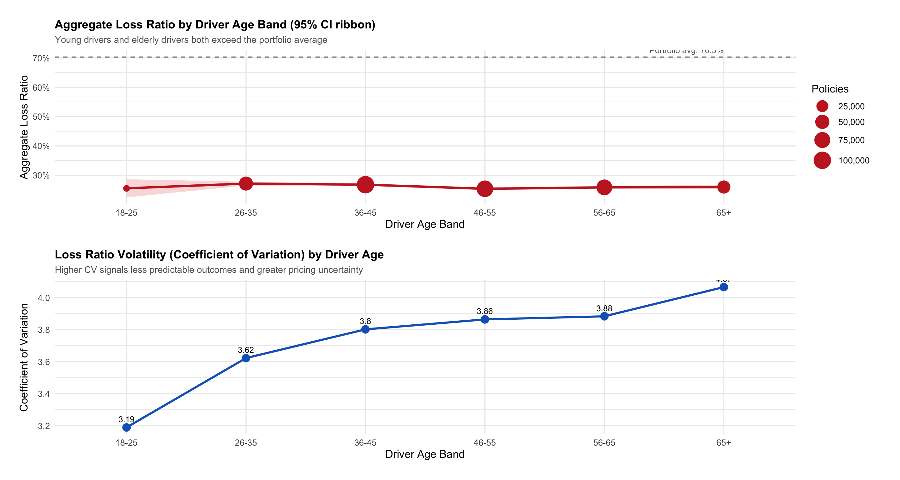
:::

::: {.column width="50%"}
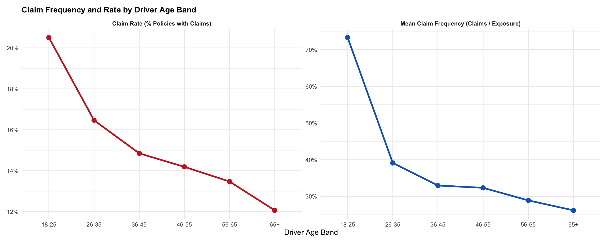
:::
:::::

::: context
**Driver age generates two analytically distinct risk signals (frequency and loss ratio) that do not align. Strategies that conflate them will either over-surcharge unprofitable segments or miss genuine risk concentrations in mid-age bands.**
:::

-   **18–25 band** has the highest claim rate and exposure-adjusted claim frequency, confirmed as a genuine frequency-risk segment, not a "young driver myth"
-   **LR is non-monotonic:** The youngest band does not consistently show the highest aggregate LR, lower-premium TP/CC products common among young drivers partially offset high frequency through lower per-claim severity
-   **Coefficient of variation (CV) peaks at both extremes:** Outcome unpredictability is highest for the youngest and oldest age bands, pricing uncertainty loads should reflect volatility, not just mean LR
-   **Mid-age stability:** Bands 36–55 show the most stable claim rates; however, severity escalation in older cohorts can still produce adverse LR, premium adequacy monitoring remains necessary
-   **Action implication:** Frequency controls (telematics, graduated excess) for 18–25; severity monitoring for 65+; a blanket age surcharge would be too blunt and would miss the severity-driven dynamics in older bands

::: notes
Driver age generates two distinct risk signals that must be read separately. Claim frequency clearly peaks at 18–25 and declines monotonically through to 46–55. However, the aggregate LR is more complex - lower-premium TP policies common among young drivers mean low severity can offset high frequency in the loss ratio. Older age bands can show elevated LR despite lower frequency if severity or premium inadequacy dominates. The CV panel identifies that outcome unpredictability is high at both ends of the age spectrum. Management should respond with frequency controls for young drivers and severity monitoring for older cohorts, not a single age loading applied uniformly.
:::

------------------------------------------------------------------------

::: insight-label
**INSIGHT #8 (GEOGRAPHIC RISK & TERRITORIAL VOLATILITY):**
:::

::: insight-title
URBAN CIRCULATION RAISES CLAIM FREQUENCY; ISLAND LOSS RATIO IS VOLATILE — DO NOT APPLY RAW LR AS TERRITORIAL LOADING
:::

::::::: three
:::::: columns
::: {.column width="33%"}
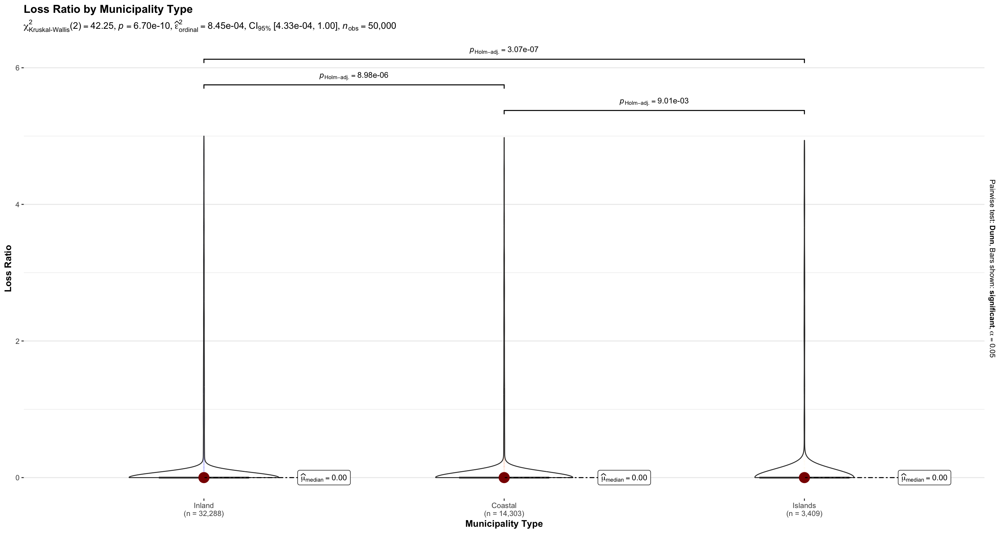
:::

::: {.column width="33%"}
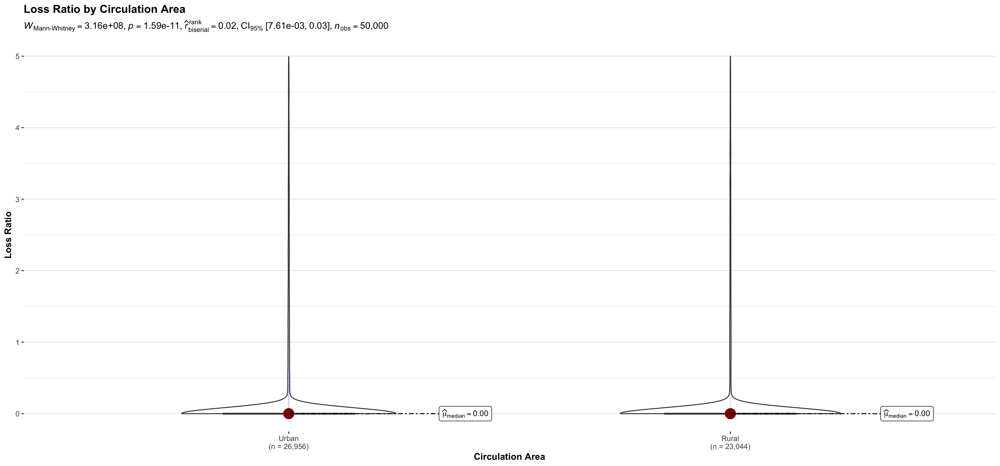
:::

::: {.column width="33%"}
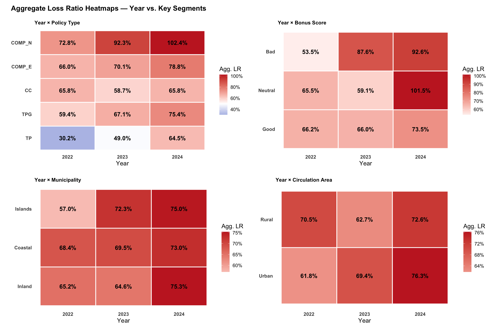
:::
::::::
:::::::

::: context
**Geography captures multiple risk proxies - traffic density, repair costs, theft exposure, and logistics. This slide separates the confirmed frequency effects of urbanism from erratic Island LR patterns driven by thin exposure, not structural risk.**
:::

-   **Urban vs. Rural:** Urban policies show statistically higher claim frequency and modestly higher aggregate LR (KW test: p \< 0.001), consistent with traffic density as a genuine, causal frequency driver
-   **Island LR volatile, not structurally worse:** Year-on-year Island swings reflect thin exposure producing wide confidence intervals, not persistent risk elevation, a flat Island loading would over-price in good years
-   **Heatmap reveals distinct 2024 signal:** COMP_N LR deteriorated specifically in 2024; Island LR remains the most erratic cell, these are separate patterns requiring different management responses
-   **Caution on territorial loading methodology:** Raw LR by geography proxies for repair inflation, logistics costs, and density, credibility-weighted relativities are required; direct LR ranking will systematically bias territorial pricing in alternate-year directions

::: notes
Urban circulation is a genuine, statistically confirmed risk factor. Higher traffic density, more low-speed incidents, and greater theft exposure drive the urban claims premium. The municipality analysis is more nuanced, Island experience shows high year-on-year LR volatility consistent with sparse exposure rather than a persistent structural risk. Applying a flat Island loading would systematically overstate risk in good years and understate it in bad ones. The heatmap is particularly useful for monitoring: it shows that COMP_N deterioration in 2024 and Island volatility are distinct patterns requiring different management responses.
:::

------------------------------------------------------------------------

::: insight-label
**INSIGHT #9 (VEHICLE VALUE & COVERAGE INTERACTION):**
:::

::: insight-title
VEHICLE VALUE DOES NOT TRANSLATE CLEANLY TO HIGHER LOSS RATIO - USE AS INTERACTION VARIABLE, NOT A STANDALONE LOADING
:::

::::: columns
::: {.column width="50%"}
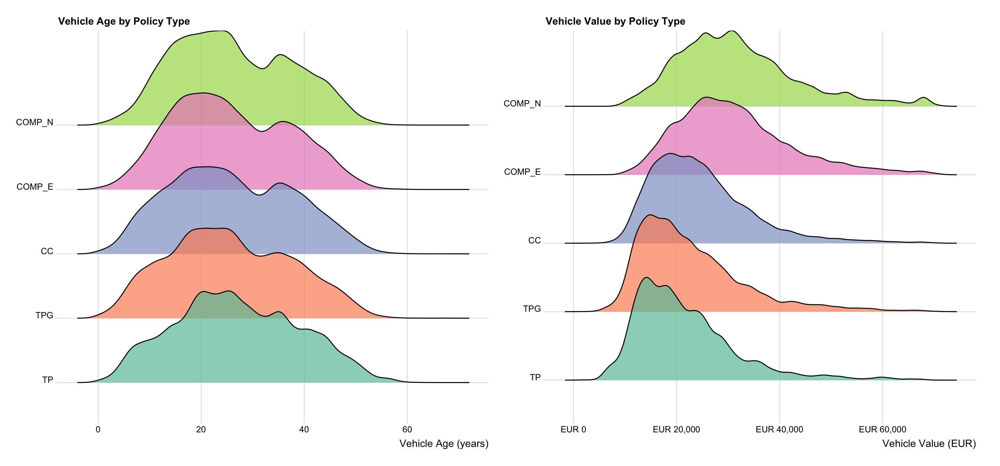
:::

::: {.column width="50%"}
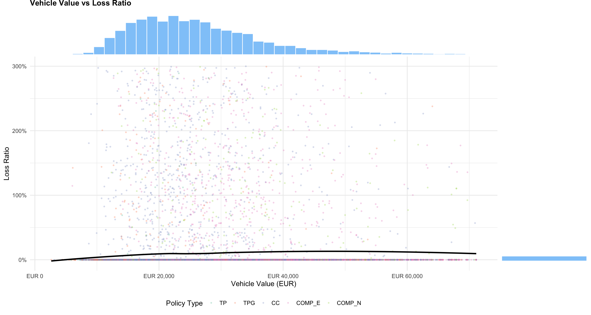
:::
:::::

::: context
**Vehicle value is intuitive as a risk predictor, but observed data shows the relationship is confounded by policy type, excess structure, and premium levels, making it unreliable as a standalone pricing variable without explicit interaction terms.**
:::

-   **Coverage-value alignment confirmed:** COMP_E/N insure newer, higher-value vehicles; TP/TPG cluster around older, lower-value assets, economically rational but creates asymmetric claims economics by product class
-   **Scatter + LOESS reveals weak, non-linear relationship:** Higher vehicle value raises claim exposure but premiums and coverage mix partially offset the severity effect, no simple monotonic LR increase
-   **Policy type confounds the standalone signal:** The LR-to-vehicle-value relationship differs by coverage class, the **interaction** between value and policy type carries more pricing information than either variable alone
-   **Reserving implication:** COMP own-damage reserves must use current market values segmented by vehicle-age band, portfolio-wide average severity will misstate replacement cost for recent high-value vehicles
-   **Practical use:** Include vehicle value as an interaction term in pricing models alongside policy type, excess level, and vehicle age rather than as a blunt additive loading

::: notes
The ridgeline confirms the intuitive coverage-vehicle alignment. The scatterplot is the more analytically important chart: higher vehicle value does not produce a clean increase in loss ratio. Premium levels, policy type, deductible structure, and claim frequency move together in ways that offset each other. Vehicle value should function as an interaction variable in pricing, tested alongside policy type, excess level, and vehicle age, rather than as a blunt standalone loading. For reserving, the implication is sharper: COMP own-damage reserves require vehicle-value segmentation because replacement costs for recent high-value vehicles diverge materially from portfolio averages.
:::

------------------------------------------------------------------------

::: insight-label
**INSIGHT #10 (CLAIM SEVERITY & PRODUCT VOLATILITY):**
:::

::: insight-title
SEVERITY SHAPES DIFFER BY PRODUCT; FREQUENCY AND SEVERITY ARE WEAKLY COUPLED — A TWO-PART PRICING FRAMEWORK IS REQUIRED
:::

::::::: three
:::::: columns
::: {.column width="33%"}
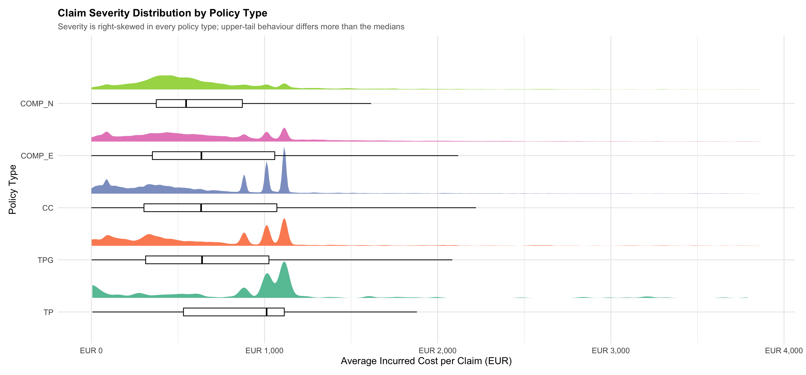
:::

::: {.column width="33%"}
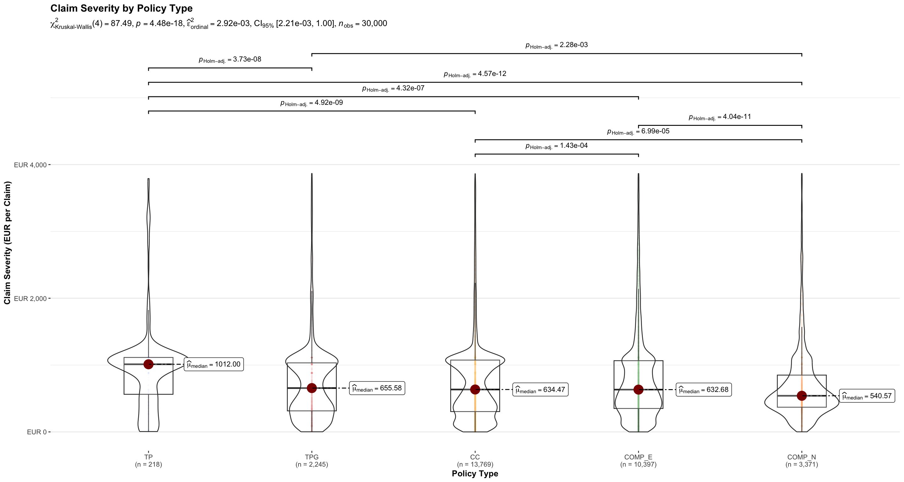
:::

::: {.column width="33%"}
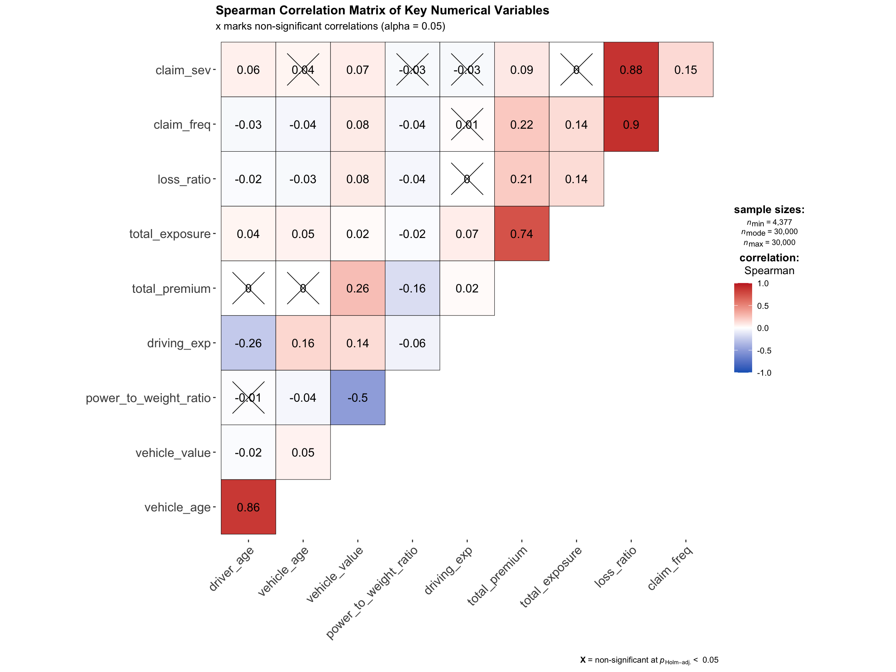
:::
::::::
:::::::

::: context
**Severity distributions differ in shape across products, and frequency and severity are near-independent signals. Treating them as a single aggregate metric produces wrong reserve estimates and misallocates risk loads between frequency-driven and severity-driven sub-books.**
:::

-   **Kruskal-Wallis test** confirms severity distributions differ significantly across policy types (p \< 0.001) — product is a genuine severity discriminator, per-product severity analysis is not optional
-   **COMP_E and COMP_N show wider IQR and heavier upper tails**: greater reserving uncertainty and higher reinsurance attachment sensitivity; a single average severity assumption systematically understates COMP exposure
-   **CC matters by volume, not per-claim size:** Not the highest per-claim severity, but as the dominant exposure class, any shift in CC average severity drives the largest absolute EUR reserve movement in the portfolio
-   **Claim frequency and claim severity are only weakly correlated** (Spearman matrix): near-independent signals — a pricing model targeting aggregate LR implicitly assumes they move together, which the data refutes
-   **Implication:** A two-part framework (separate frequency model + severity model) is required; combined aggregate models will systematically misallocate risk loads between high-frequency/low-severity and low-frequency/high-severity segments

::: notes
The raincloud shows severity distributions are right-skewed in every product type, but the key heterogeneity is in the upper tails: COMP covers have the heaviest tails, CC has the greatest absolute reserve sensitivity due to volume. The correlation matrix adds the critical second finding — claim frequency and claim severity have only weak Spearman correlation, confirming they are near-independent drivers. A single aggregate loss model cannot distinguish a portfolio with many small claims from one with few catastrophic ones, yet both can produce the same total incurred. The two-part pricing framework implied by this finding is directly supported by Recommendation 6. Reserve projections must separate attritional from large-loss modelling per product type; IBNR cannot use a single severity point estimate across all covers.
:::

------------------------------------------------------------------------

::: insight-label
**INSIGHT #11 (LARGE-LOSS LAYERS & FUNNEL ANALYSIS):**
:::

::: insight-title
LARGE-LOSS BURDEN SPANS MULTIPLE COVERS; FUNNEL IDENTIFIES GENUINE HIGH-FREQUENCY CELLS INCLUDING COMP_N/GOOD BONUS
:::

::::: columns
::: {.column width="50%"}
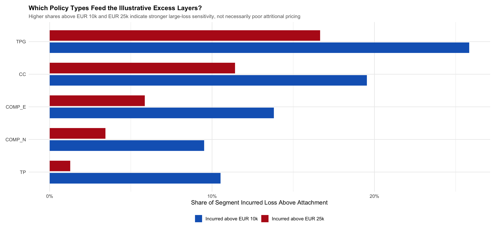
:::

::: {.column width="50%"}
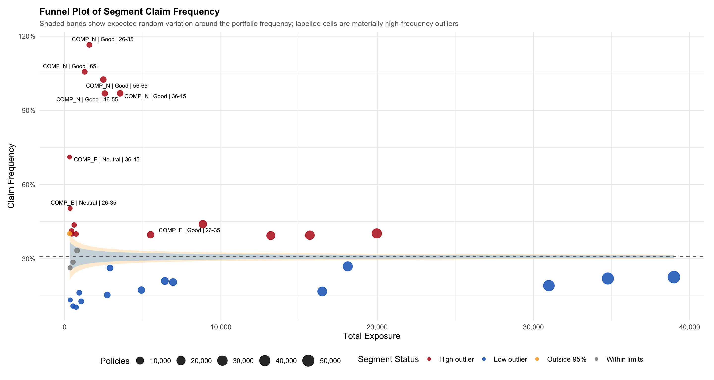
:::
:::::

::: context
**Two complementary techniques, excess-of-loss layer analysis and funnel plot control limits, distinguish genuine tail risk from volume effects and thin-data noise, enabling more targeted reinsurance and underwriting responses.**
:::

-   **Multi-cover tail:** CC contributes the largest absolute incurred share (volume effect); COMP_E holds the maximum individual policy-year loss; TPG shows the highest excess-layer sensitivity relative to its own incurred base
-   **XL treaty design implication:** Multi-cover tail accumulation means excess-of-loss programs must address cross-product concentration; structuring programs product-by-product will leave accumulation gaps
-   **Funnel methodology:** Control limits adjust for unequal segment exposure, flagged outliers are genuinely high-frequency relative to their size, not statistical noise from thin data
-   **Counterintuitive finding:** Several COMP_N / Good bonus cells exceed the 99.8% control limit, product structure can **override** bonus history as the dominant frequency signal in certain sub-segments
-   **Implication:** Broad young-driver or bad-bonus surcharges will miss structural high-frequency COMP_N cells, targeted product-level and coverage-interaction underwriting responses are more effective than blunt demographic loadings

::: notes
The large-loss layer chart reveals that tail exposure is not confined to comprehensive products. CC's dominance in incurred share is a volume effect; COMP_E retains the maximum individual policy-year loss; TPG shows disproportionate excess sensitivity. Reinsurance program design must address this cross-cover accumulation. The funnel plot adds a complementary governance tool: identifying high-frequency cells after adjusting for exposure size. The counterintuitive finding is COMP_N with Good bonus history appearing as a genuine outlier, showing that product structure can dominate historical claims experience as a frequency predictor. Broad surcharges on young or bad-bonus policyholders will miss these structural exposure cells.
:::

------------------------------------------------------------------------

::: insight-label
**INSIGHT #12 (TEMPORAL, FLOW & ADJUSTED RISK SYNTHESIS):**
:::

::: insight-title
PORTFOLIO GREW WITH SUSTAINED PROFITABILITY; POLICY TYPE IS THE STRONGEST ADJUSTED CLAIM-PROPENSITY SIGNAL
:::

::::::: three
:::::: columns
::: {.column width="33%"}
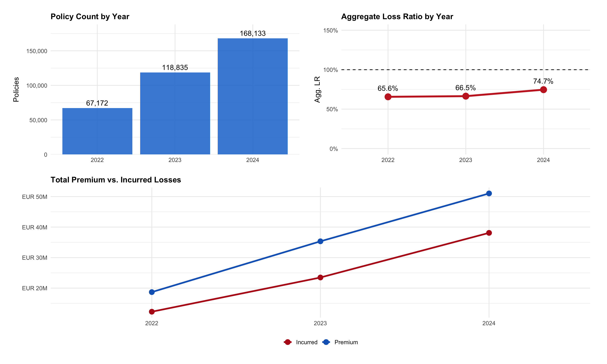
:::

::: {.column width="33%"}
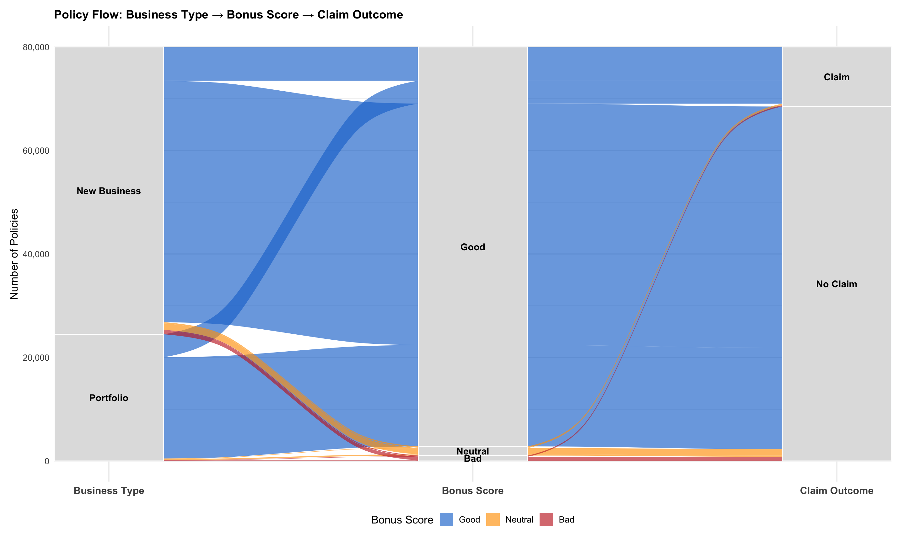
:::

::: {.column width="33%"}
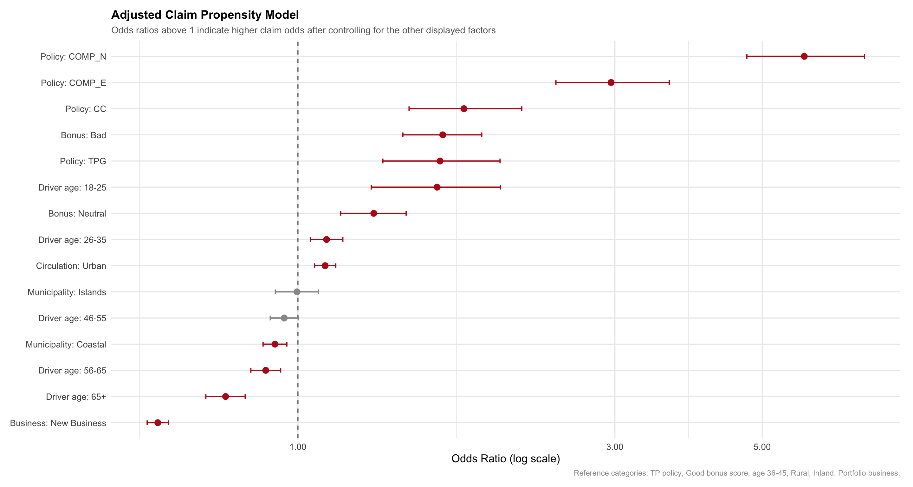
:::
::::::
:::::::

::: context
**The synthesis slide confirms that bivariate patterns from slides 3–11 hold after multivariate statistical adjustment, and tracks temporal performance to distinguish structural deterioration from single-year large-loss events in 2024.**
:::

-   **Temporal:** Portfolio grew profitably across 2022–2024; COMP_N LR deteriorated specifically in 2024, requires investigation to distinguish structural underpricing from transient large-loss clustering before next renewal
-   **Alluvial flow:** Good bonus dominates the no-claim stream largely by volume. Bad and Neutral tiers' claim flow is proportionally higher than their policy count, confirming genuine behavioural risk stratification
-   **Adjusted odds ratios (policy type strongest):** COMP_N and COMP_E carry significantly higher adjusted claim odds than TP after controlling for age, geography, and business type, product structure is the primary risk driver
-   **Young age and poor bonus retain independent effects:** Both variables remain significant after adjustment, they are genuine signals, not proxies for product selection, and should both be retained in the rating structure
-   **Workflow validation:** The composition → comparison → adjustment diagnostic sequence produces coherent findings; no earlier bivariate insight is reversed by multivariate control

::: notes
The synthesis view confirms that visual patterns from earlier bivariate slides hold after statistical adjustment. The temporal charts show portfolio growth with stable aggregate profitability, but the 2024 COMP_N deterioration is a monitoring priority. The alluvial flow shows that Good bonus dominance in the no-claim stream is largely a volume effect; claim concentration in Neutral and Bad tiers is proportionally higher than their share. The odds-ratio model confirms policy type as the primary adjusted predictor, with young driver age and poor bonus history as secondary independent signals. Visual analytics, used as a diagnostic workflow, composition, comparison, adjustment, produces actionable, coherent findings.
:::

------------------------------------------------------------------------

## Conclusions & Managerial Recommendations {.conclusion-slide}

:::::::::::: columns
:::: {.column width="52%"}
**Key Findings**

::: kf-table
| Theme              | Key Finding                                         |
|:-------------------|:----------------------------------------------------|
| **Profitability**  | Aggregate LR \~70%; profitable but tail-sensitive   |
| **Policy type**    | COMP_N highest LR; deteriorated in 2024             |
| **Young drivers**  | Highest claim frequency; LR nuanced, not U-shape    |
| **Bonus-malus**    | Statistically valid frequency discriminator         |
| **Geography**      | Urban drives frequency; Islands volatile, not worse |
| **Severity**       | Right-skewed in all products; COMP tails heaviest   |
| **Tail risk**      | Multi-cover concentration: CC + COMP_E + TPG        |
| **Adjusted model** | Policy type is the strongest adjusted risk signal   |
:::
::::

::::::::: {.column width="46%"}
**Managerial Recommendations**

::: rec-box
**1. Review COMP_N pricing urgently**: highest LR + 2024 deterioration; investigate excess/deductible structure and vehicle-value mix before next renewal cycle
:::

::: rec-box
**2. Implement targeted frequency controls for 18–25 drivers**: telematics or graduated excess; a blanket age surcharge would miss the severity dynamics in older cohorts
:::

::: rec-box
**3. Credibility-weight all territorial factors**: do not apply raw Island or Urban LR as a pricing loading; exposure-volume adjustment is mandatory to avoid alternating-year bias
:::

::: rec-box
**4. Retain and extend the bonus-malus system**: actuarially validated; integrate with policy type and driver age as joint interaction terms in the rating structure
:::

::: rec-box
**5. Review XL reinsurance retention**: multi-cover tail accumulation (CC + COMP_E + TPG) supports excess-of-loss over quota-share for earnings volatility smoothing
:::

::: rec-box
**6. Separate frequency and severity pricing models**: weak mutual correlation confirms a combined model will misallocate risk loads; two-part modelling framework is warranted
:::
:::::::::
::::::::::::

::: notes
The portfolio is profitable but structurally complex. Profitability is driven by the high-volume no-claim majority; retained earnings volatility originates from a concentrated tail spread across multiple product classes. Immediate priorities: address COMP_N pricing given 2024 deterioration; implement targeted frequency controls for young drivers; and shift to credibility-weighted territorial factors. The bonus-malus system is actuarially sound and should be retained and extended. Reinsurance structure should be reviewed given multi-cover tail accumulation. Longer-term, a frequency-severity pricing framework, supported by the weak correlation finding, will produce better risk allocation than the current aggregate approach.
:::
